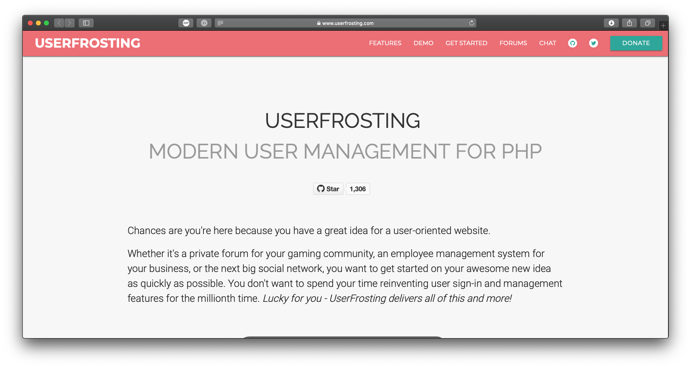

UserFrosting is a secure, modern user management system written in PHP and built on top of the Slim Microframework, Twig templating engine, and Eloquent ORM.

===

I've been working with the UserFrosting team since summer 2016. At that time, I was looking for a new User Management framework to start working on some new projects. During my research, I came across UserFrosting which was the project at the time that had (almost) all the features I was looking at the time : Localization support, templating support, admin interface, etc.

I quickly got involved with the development team as I started working on fixes for the internationalization system, [the i18n package](https://github.com/userfrosting/i18n) and later with the Bakery CLI interface. Since I finished my work on GASTON in April 2018, UserFrosting have been my primary focus. Recently, I've been mostly working on the **4.2.0 version** and on meeting our code coverage goals in preparation for the upcoming 4.3 version.

My contribution to UserFrosting includes :
 - The Bakery CLI tool;
 - Rewriting of the internationalization system;
 - Migration system;
 - Rewriting of the Uniform Resource Locator;
 - Continuous support on the [chat](https://chat.userfrosting.com) and the [forums](https://forums.userfrosting.com);
 - Update to the [_learn_ documentation website](https://learn.userfrosting.com), including support for older version of UserFrosting;

Working on UserFrosting, with continuous support from Alexander Weissman, the project lead, really helped me become a better developer in the last years. Before working on UserFrosting, I never used Composer and Unit Testing was an abstract concept. I never even used PHP Classes and Interfaces before! Coming from an outdated version of phpBB, I was still writing spaghetti code. Now code quality, Unit Testing, good dependencies and code documentation are the most important part of coding for me, as well as helping others.

#### Project details
- Website : <https://www.userfrosting.com>
- GitHub : <https://github.com/userfrosting/UserFrosting>
- Role : Main contributor
- Worked on the project since 2016
