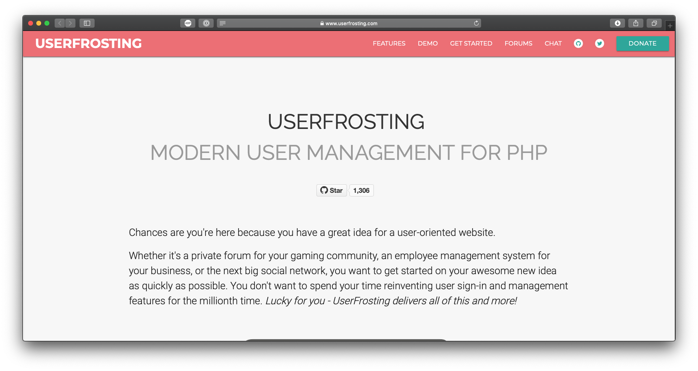

UserFrosting est un système de gestion d’utilisateurs moderne et sécurisé, écrit en PHP et basé sur le Slim Microframework, le moteur de création de templates Twig et Eloquent ORM.

===

Je travaille avec l'équipe de UserFrosting depuis l'été 2016. À cette époque, je cherchais un nouveau framework de gestion des utilisateurs pour commencer à travailler sur de nouveaux projets. Au cours de mes recherches, je suis tombé sur UserFrosting, projet à l’époque qui comportait (presque) toutes les fonctionnalités que je cherchais : moteur de traduction, support pour thèmes, interface d’administration, etc.

Je me suis rapidement impliqué dans l'équipe de développement en commençant à travailler sur des correctifs pour le système de traduction, [le paquet i18n] (https://github.com/userfrosting/i18n), puis avec l'interface en ligne de commande (CLI) _Bakery_. Depuis que j'ai terminé mon travail sur GASTON en avril 2018, ma priorité était UserFrosting. Récemment, j'ai principalement travaillé sur la version ** 4.2.0 ** et sur la réalisation de nos objectifs de couverture de code en vue de la prochaine version 4.3.

Mes contributions au projet UserFrosting comprennent :
 - l’outil en ligne de commande _Bakery_;
 - la réécriture du système de traduction;
 - le système de migration de base de données;
 - La réécriture du _Uniform Resource Locator_;
 - Le support technique continue sur le [chat](https://chat.userfrosting.com) et les [forums](https://forums.userfrosting.com);
 - La mise à jour du [site Web de documentation _learn_](https://learn.userfrosting.com), avec prise en charge de la documentation des anciennes versions de UserFrosting;

Travailler sur UserFrosting, avec le soutien continu de Alexander Weissman, le responsable du projet, m'a vraiment aidé à devenir un meilleur développeur ces dernières années. Avant de travailler sur UserFrosting, je n’avais jamais utilisé Composer et les _Unit Tests_ étaient un concept abstrait. Je n'avais même jamais utilisé les classes et les interfaces PHP auparavant! Venant d’une version obsolète de phpBB, j’écrivais encore du code spaghetti. Maintenant, la qualité du code, les tests, les dépendances à jours et la documentation du code sont les éléments les plus importants pour moi, en plus d'aider les autres.

#### Détails du projet
- Site Web : <https://www.userfrosting.com>
- GitHub : <https://github.com/userfrosting/UserFrosting>
- Rôle : Développeur principal
- Travaille sur le projet depuis 2016
