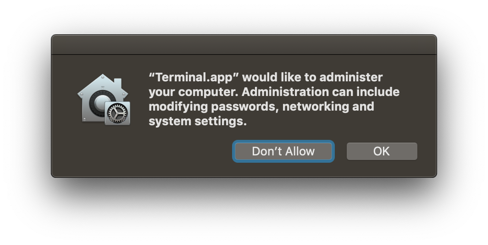
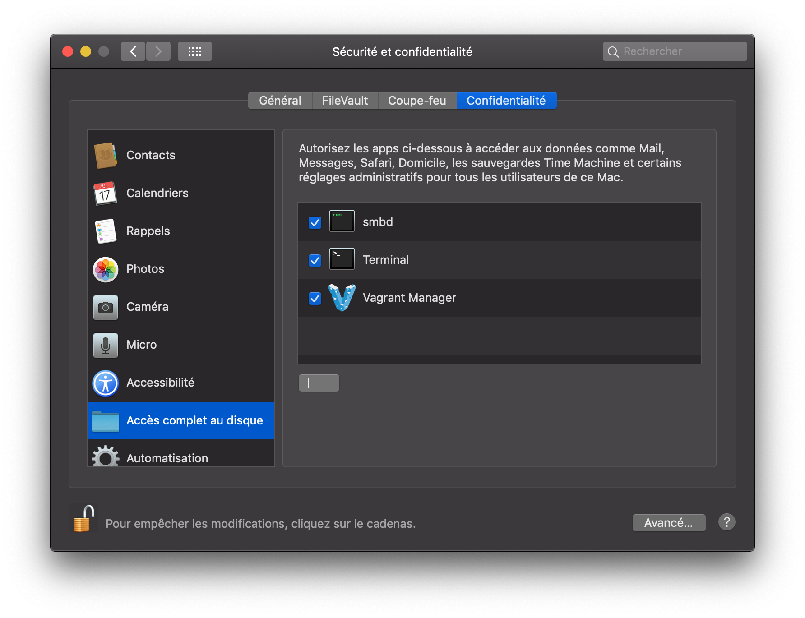

Avec le nouveau système d'autorisation de MacOS Mojave (10.14), vous devez autoriser toutes les applications nécessitant un accès à votre ordinateur. Ce n'est pas différent lorsque vous utilisez Vagrant, car certains fichiers système en dehors de ceux contrôlés par Vagrant sont utilisés et manipulé par Vagrant, en particulier lorsque vous utilisez l'option `nfs` pour l'accès aux fichiers.

===

## MacOS Permission alert

Depuis Mojave, Vagrant n'est plus capable d'écrire dans `/etc/exports` pour faire la configuration du NFS. Vagrant ne peut plus faire appel à l'utilisateur root directement en raison de la protection de l'intégrité du système (_System Integrity Protection_). Vagrant demande maintenant votre mot de passe (via `sudo`) chaque fois que vous lancer la machine virtuelle. De plus, cette alerte apparaitra lorsque que vous aurez entré votre mot de passe.



Premièrement, pour vous débarrasser de cette alerte, vous devez donner au Terminal, ou à l’application que vous utilisez pour gérer Vagrant, l’autorisation `Accès complet au disque` de l'onglet _Sécurité et confidentialité_ dans les _Préférences Système_. Dans mon cas (voir l'image ci-dessous), j'ai également ajouté [Vagrant Manager](http://vagrantmanager.com) à la liste, car j'utilise cette application pour voir rapidement quelle boîte est en cours d'exécution.



## Asking for password

En ce qui concerne le mot de passe root, il peut être ennuyant d'entrer votre mot de passe chaque fois que vous lancez une machine virtuelle. Voici un exemple de ce que vous verrez lors du chargement d’une machine :

```
$ homestead reload
==> homestead-7: Checking if box 'laravel/homestead' version '7.1.0' is up to date...
==> homestead-7: Clearing any previously set forwarded ports...
==> homestead-7: Clearing any previously set network interfaces...
==> homestead-7: Preparing network interfaces based on configuration...
    homestead-7: Adapter 1: nat
    homestead-7: Adapter 2: hostonly
==> homestead-7: Forwarding ports...
    homestead-7: 80 (guest) => 8000 (host) (adapter 1)
    homestead-7: 443 (guest) => 44300 (host) (adapter 1)
    homestead-7: 3306 (guest) => 33060 (host) (adapter 1)
    homestead-7: 4040 (guest) => 4040 (host) (adapter 1)
    homestead-7: 5432 (guest) => 54320 (host) (adapter 1)
    homestead-7: 8025 (guest) => 8025 (host) (adapter 1)
    homestead-7: 27017 (guest) => 27017 (host) (adapter 1)
    homestead-7: 22 (guest) => 2222 (host) (adapter 1)
==> homestead-7: Running 'pre-boot' VM customizations...
==> homestead-7: Booting VM...
==> homestead-7: Waiting for machine to boot. This may take a few minutes...
    homestead-7: SSH address: 127.0.0.1:2222
    homestead-7: SSH username: vagrant
    homestead-7: SSH auth method: private key
==> homestead-7: Machine booted and ready!
==> homestead-7: Checking for guest additions in VM...
==> homestead-7: Setting hostname...
==> homestead-7: Configuring and enabling network interfaces...
==> homestead-7: Exporting NFS shared folders...
==> homestead-7: Preparing to edit /etc/exports. Administrator privileges will be required...
Password:
```

La plupart des solutions trouvés sur Google suggèrent d’éditer le fichier `/etc/sudoers`. Personnellement, je préfère créer un nouveau fichier de configuration dédié dans `/etc/sudoers.d`. Chaque fichier de ce répertoire sera automatiquement ajouté à la configuration _sudoers_.

Créez simpelment un nouveau fichier :
`sudo nano /etc/sudoers.d/vagrant-syncedfolders`

Et collez le contenu suivant :
```
Cmnd_Alias VAGRANT_EXPORTS_ADD = /usr/bin/tee -a /etc/exports
Cmnd_Alias VAGRANT_NFSD = /sbin/nfsd restart
Cmnd_Alias VAGRANT_EXPORTS_REMOVE = /usr/bin/sed -E -e /*/ d -ibak /etc/exports
%admin ALL=(root) NOPASSWD: VAGRANT_EXPORTS_ADD, VAGRANT_NFSD, VAGRANT_EXPORTS_REMOVE
```


## Références
- <https://www.vagrantup.com/docs/synced-folders/nfs.html#root-privilege-requirement>
- <https://user-images.githubusercontent.com/104180/46012003-01bdac80-c0c8-11e8-87b5-79b2114e38b3.png>
- <https://github.com/hashicorp/vagrant/issues/10234>
