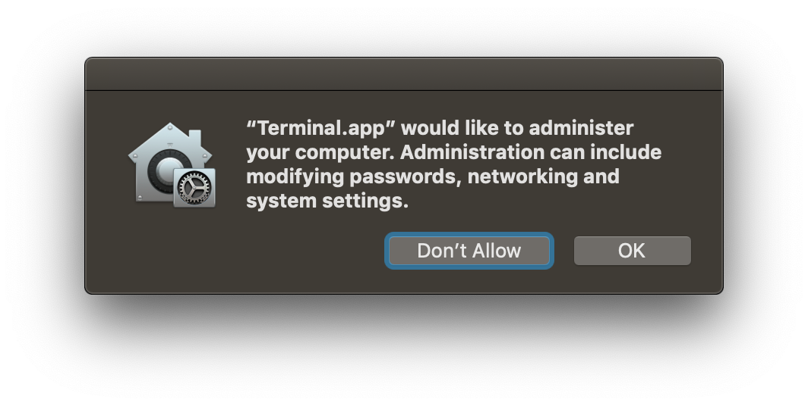
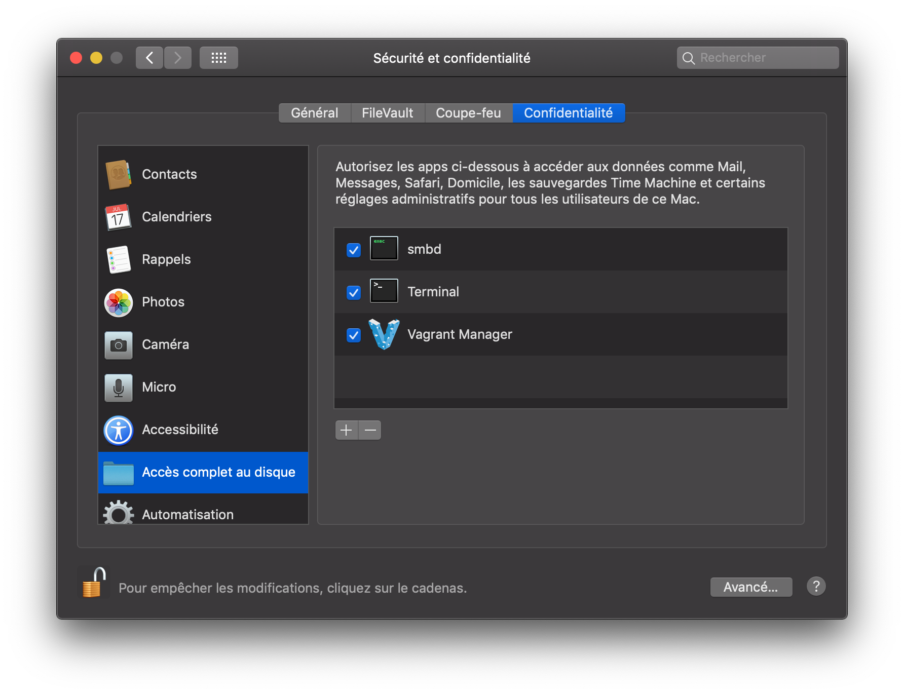

## MacOS Permission alert

With new permission system in MacOS Mojave (10.14), every apps that requires access to your computer must be granted permissions. This is no different when using Vagrant, as some system files outside of Vagrant controls are required, especially when using `nfs` for file access.

Since Mojave, Vagrant is not able to write to /etc/exports anymore while trying to make a NFS mount. The root user isn't allowed to do that anymore due to System Integrity Protection. Vagrant now ask for your root (sudo) password everytime you bring you machine up. Plus, this nice little windows will popup once you do enter your password.




First, to get rid of this popup, you need to give the Terminal, or whatever app you’re using to manage your Vagrant box, the `Full Disk Access` permission from Security & Privacy in System Preferences. In my case (imagine below), I also added Vagrant Manager to the list, as I use this nice little app to visually manage and see which box is currently running.




## Asking for password

As for the root password, it can be annoying to enter your password every time you up your machine. This is an example of what you’ll see when loading a box :  

```
$ homestead reload
==> homestead-7: Checking if box 'laravel/homestead' version '7.1.0' is up to date...
==> homestead-7: Clearing any previously set forwarded ports...
==> homestead-7: Clearing any previously set network interfaces...
==> homestead-7: Preparing network interfaces based on configuration...
    homestead-7: Adapter 1: nat
    homestead-7: Adapter 2: hostonly
==> homestead-7: Forwarding ports...
    homestead-7: 80 (guest) => 8000 (host) (adapter 1)
    homestead-7: 443 (guest) => 44300 (host) (adapter 1)
    homestead-7: 3306 (guest) => 33060 (host) (adapter 1)
    homestead-7: 4040 (guest) => 4040 (host) (adapter 1)
    homestead-7: 5432 (guest) => 54320 (host) (adapter 1)
    homestead-7: 8025 (guest) => 8025 (host) (adapter 1)
    homestead-7: 27017 (guest) => 27017 (host) (adapter 1)
    homestead-7: 22 (guest) => 2222 (host) (adapter 1)
==> homestead-7: Running 'pre-boot' VM customizations...
==> homestead-7: Booting VM...
==> homestead-7: Waiting for machine to boot. This may take a few minutes...
    homestead-7: SSH address: 127.0.0.1:2222
    homestead-7: SSH username: vagrant
    homestead-7: SSH auth method: private key
==> homestead-7: Machine booted and ready!
==> homestead-7: Checking for guest additions in VM...
==> homestead-7: Setting hostname...
==> homestead-7: Configuring and enabling network interfaces...
==> homestead-7: Exporting NFS shared folders...
==> homestead-7: Preparing to edit /etc/exports. Administrator privileges will be required...
Password:
```

Most solutions suggest editing the `/etc/sudoers` files. I personally prefer creating a new dedicated config file in `/etc/sudoers.d`. Every file in this directory will be automatically appended to the sudoers config.

Simply create a new file :
`sudo nano /etc/sudoers.d/vagrant-syncedfolders`

And paste the following in :
```
Cmnd_Alias VAGRANT_EXPORTS_ADD = /usr/bin/tee -a /etc/exports
Cmnd_Alias VAGRANT_NFSD = /sbin/nfsd restart
Cmnd_Alias VAGRANT_EXPORTS_REMOVE = /usr/bin/sed -E -e /*/ d -ibak /etc/exports
%admin ALL=(root) NOPASSWD: VAGRANT_EXPORTS_ADD, VAGRANT_NFSD, VAGRANT_EXPORTS_REMOVE
```


## References
- <https://www.vagrantup.com/docs/synced-folders/nfs.html#root-privilege-requirement>
- <https://user-images.githubusercontent.com/104180/46012003-01bdac80-c0c8-11e8-87b5-79b2114e38b3.png>
- <https://github.com/hashicorp/vagrant/issues/10234>
