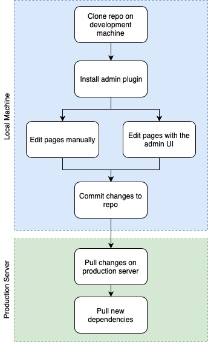

While creating this blog and working on UserFrosting documentation website, I came across the issue of deploying the live site to their respective production servers (VPS). Since both sites have their source code on GitHub, using a post-receive hook seamed the obvious choice for automated deployment. Unfortunately, there’s no definitive way of handling the hook call on the server. Both sites being built with Grav, I quickly came across the [git-sync plugin](https://github.com/trilbymedia/grav-plugin-git-sync). After some quick testing, I figured out this plugin wasn’t of use to me and a custom hook would be better.

[center][/center]

## Git-sync issues

First, it requires your GitHub password or token, which give access to your entire GitHub account. While this sensitive information is encrypted by the plugin, it’s still not the most secure option in my opinion, compared to using per repo deployment key. Unfortunately, git-sync doesn’t support [key based authentication yet](https://github.com/trilbymedia/grav-plugin-git-sync/issues/110).

But a bigger issue I had with the plugin is it overwrite your `.gitignore` configuration. This could be fine for most people, but I prefer a little more control over my git repositories. Even if you ask the plugin only to sync the `pages/` directory, it will change the `.gitignore` file in a way your config files could be deleted. It even deleted my `.dependencies` file in my testing! In the end, this plugin is good to keep an automatic backup of your site and for people with less technological knowledge, but for a more advanced solution, I figured a custom deployment hook wouldn’t required much more work compared to dealing with the plugin.

## Using the admin plugin only in development mode

My next thought was regarding the use of the admin plugin on the production server. While it’s nice to be able to write and edit the blog on the go, is it really necessary for me? Sure, the admin UI would allow me to post directly from my work computer (which has nothing to do with coding, so has nothing setup for it) or even my iPhone. But not having a UI to write directly to this blog doesn’t mean I can’t write my thought in the phone notes app or _Dropbox Paper_ (which is where this article was actually first written !) and posting it later. Furthermore, I could post the article from anywhere by login in to my GitHub account if it was a real emergency (is it ever ?).

With that in mind, I decided to keep the Grav admin UI only on my development environment, aka my laptop and desktop at home. My final process of writing a new post looks like this :

[center][/center]

## Deployment hook

The only thing left to do is automating the steps on the production server, which brings us back to git-sync. Now, if the admin plugin isn’t installed on the production server, the git-sync plugin won’t be much of use, except for the hook to pull any update. With everything said so far about this plugin, using it only for the hook isn’t worth it.

At this time, I’m still looking at options on how to manage receiving hook from GitHub, but I’ll probably end up writing my own script and try not to end up in a permission nightmare. I’ll write a new post when I figure out the best solution.

In a future post, I’ll also talk about setting up the [UserFrosting documentation website](https://learn.userfrosting.com), which is also build using Grav. This one is a little trickier as it uses git submodules to enabled access to different version of the documentation stored in the same repo. This is a little bit more complex, as the hook needs not only to pull from GitHub, but also update the submodules and push back the result to GitHub, without creating an infinite look. That’s one more use case where the  `git-sync` plugin can’t be of use.
