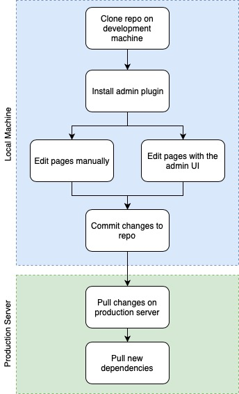

Lors de la création de ce blog et de la mise à jours de la documentation de UserFrosting, je suis tombé sur le problème du déploiement des deux sites sur leurs serveurs de production respectifs (dans ce cas, deux VPS). Étant donné que les deux sites ont leur code source sur GitHub, l’utilisation d’un « post-receive hook » constituait le choix évident pour un déploiement automatisé. Malheureusement, il n’y a pas de méthode définitive pour gérer la requête sur le serveur de production. Les deux sites étant construits avec Grav, je suis rapidement tombé sur le [plug-in git-sync](https://github.com/trilbymedia/grav-plugin-git-sync). Après quelques tests rapides, je me suis rendu compte que ce plugin ne me serait pas utile et qu’une solution personnalisé serait mieux.

## Problèmes du plugin Git-Sync

Premièrement, le plugin nécessite le mot de passe ou _token_ d'un compte GitHub, ce qui donne accès à l’ensemble de son profil. Bien que ces informations sensibles soient cryptées par le plug-in, sauvegarder ceci sur le serveur n’est pas toujours l’option la plus sécurisée à mon avis, comparé à l’utilisation d’une clé de déploiement SSH. Malheureusement, git-sync ne supporte pas encore [l’authentification par clé SSH](https://github.com/trilbymedia/grav-plugin-git-sync/issues/110).

Mais un problème plus important que j'ai eu avec le plugin est qu'il écrase le fichier `.gitignore`. Cela pourrait convenir à la plupart des gens, mais je préfère un peu plus de contrôle sur mes dépôts git. Même si vous demandez au plug-in de ne synchroniser que le répertoire `pages/` de Grav, cela modifiera quand même le fichier `.gitignore` avec comme résultat que vos fichiers de configuration risque d'être supprimés. Lors de mes tests, la synchronisation a même supprimé mon fichier `.dependencies`! En fin de compte, ce plugin est bon pour garder une sauvegarde automatique de votre site et pour les personnes ayant moins de connaissances techniques, mais pour une solution plus avancée, je pense qu'un _Webhook_ personnalisé ne nécessiterait pas beaucoup plus de travail que d'utiliser ce plugin.

## Utiliser le plugin admin uniquement en mode développement

Ma pensée suivante concernait l’utilisation du plugin admin de Grav sur le serveur de production. Bien qu’il soit agréable de pouvoir éditer le blog à tout moment via l'interface, est-ce vraiment nécessaire pour mon usage? Bien sûr, en cas d'inspiration soudaine, l'interface utilisateur me permettrait d'ajouter un nouvel article directement à partir de mon ordinateur au travail (travail qui n'a rien à voir avec la programmation, donc l'ordinateur n'est pas configuré avec _git_) ou même depuis mon iPhone. Mais même sans avoir d’interface utilisateur pour écrire directement sur ce blog, je peux toujours utiliser l’application _Notes_ de mon iPhone ou _Dropbox Paper_ (où cet article a été écrit au départ) et envoyer le texte sur git plus tard. Le tout sans compter qu'il est toujours possible d'écrire l'article de n'importe où via le site web de GitHub, s'il s'agissait d'une urgence (c'est possible?).

Gardant cela à l’esprit, j’ai décidé de conserver l’interface utilisateur de Grav admin uniquement dans mon environnement de développement, autrement dit mon ordinateur portable et mon ordinateur de bureau à la maison. Mon processus final d'écriture d'un nouveau post ressemble à ceci:

[center][/center]

## Webhook pour le déploiement

Il ne reste plus qu'à automatiser les étapes à faire sur le serveur de production, ce qui nous ramène à git-sync. Maintenant, si le plug-in admin n’est pas installé sur le serveur de production, le plug-in git-sync ne sera pas très utile, outre le _Webhook_ pour recevoir la requête envoyé par GitHub lors d'un _push_. Bref, avec tout ce qui a été dit à propos de ce plugin, l’utiliser uniquement pour le _Webhook_ n’en vaut pas la peine.

Pour le moment, je suis toujours à la recherche de solutions pour gérer la requête envoyé par GitHub, mais j'ai l'impression que je vais probablement finir par écrire mon propre script de déploiement et essayer de ne pas tomber dans une roue sans fin avec la gestion des permissions UNIX. Je vais écrire un nouveau post lorsque je trouverai la meilleure solution.

Dans un prochain article, je parlerai également de la configuration du site Web de [documentation UserFrosting](https://learn.userfrosting.com), qui est également fait avec Grav. Celui-ci est un peu plus compliqué, car il utilise des sous-modules git pour permettre l'accès à différentes versions de la documentation stockée dans le même _repo_ git. Ceci est un peu plus complexe, car le déploiement doit non seulement mettre à jour les fichiers depuis GitHub, mais également mettre à jour les sous-modules et renvoyer les changements vers GitHub, sans créer de boucle infinie. C’est d'ailleurs un autre cas où le plugin `git-sync` ne peut pas être utile.
