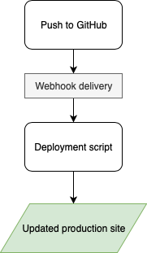
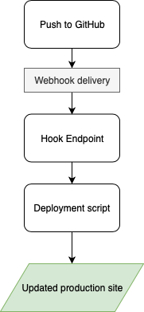
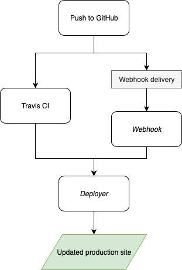

In my quest to setup an automatic deployment solution for a website built with Grav, I've already [established the Grav git-sync plugin wasn't exactly suiting my needs](/blog/grav-git-sync). I've made a lot of research since and I'm surprise to see very few solution out there, not just for Grav, but for post-commit scripts and Webhooks in general.

===

Basically, what I need is something that will update the files on my productions servers every time a new commit is pushed to GitHub :

[center]

[size=12]Source: <https://github.com/mauris/Deployer>[/size]
[/center]

 This sounds easy, as GitHub provides [Webhooks](https://developer.github.com/webhooks/) to ping the production server. All we need now is a deployment script to have our app automatically deployed on the production server on push. This deployment script, in Grav's case, would simply have to do a `git pull` and `bin/grav clear-cache` operation.

[center][/center]

The reality is you need an endpoint on your server to receive the hook. Moreover, this endpoint needs to be reachable through a public facing URL. This is where it gets difficult, because there is not a lot of documentation or "all in one" package to handle that.

## Potential candidates

The most popular result when searching for a git hook deployment solution involve [a bare git repository and `post-receive` hook](https://gist.github.com/noelboss/3fe13927025b89757f8fb12e9066f2fa) on the production server. However, while this method is the easiest to implement, it's not automatic and can't be directly called by GitHub Webhook API. The only way this could be used in an automated way would be to use Travis CI to push to the production server after a successful test.

Other popular results either [are 6 years old](https://github.com/mboynes/github-deploy), [doesn't offer great script support](https://github.com/adnanh/webhook), [offers only 1 repo for free](https://signup.deploybot.com/signup/new#pricing), [offers only a 10 days free trial](https://www.deployhq.com/pricing), [include a huge security vulnerability](https://gist.github.com/oodavid/1809044#gistcomment-2237254), [looks overly complicated](https://www.heroku.com/home), [is just a pile of spaghetti code](https://github.com/markomarkovic/simple-php-git-deploy/blob/master/deploy.php) or [doesn't handle the public url](https://deployer.org). [One result was close](https://github.com/scriptburn/git-auto-deploy), but it contained a web accessible UI which I didn't looked too secure at first glance.

The [Github documentation](https://developer.github.com/v3/guides/delivering-deployments/#writing-your-server) point to [Sinatra](http://sinatrarb.com/), a ruby application used to quickly creating web applications. Unfortunately, Sinatra is more oriented to localhost use, not as a daemon on a production server.

This means there _is_ a need for **a new self hosted one click deployment solution**. Or is it ?

## Writing my own service

At this point I considered creating my own deployment app. Question is, what does a good deployment app do? How does it work? And what would it look like if I wrote it? Let's make a list:

1. Written in PHP (faster, easier for me to code);
1. Easy setup via Composer, either globally or per project;
1. No UI. Only frontend is the hook script at a given URL. A CLI app is perfect for added security and easier setup and usage than a PHP script;
1. Public URL for hook handling outside of the repo we want to deploy [for added security](https://www.exploit-db.com/ghdb/4593);
1. Requires SSH Keys, no stored password or token;
1. Can be integrated to existing app via Composer, using `vendor/bin/post-receive`;
1. Can manage server permissions, while being secure (can `sudo` a command if required);
1. Supports Grav, but other sites too;
1. Support GitHub webhooks, but modular enough to be able to integrate other providers (BitBucket, etc.);
1. Configuration done through flat file storage. When used inside an app, config can be stored in a `.deployment` file;

So there we are. A CLI app, written using Symfony marvelous [Console Component](https://symfony.com/doc/current/components/console.html), and capable of deploying your code, with a front facing URL to handle the receiving hook request !

But wait, something doesn't add up. If this app can be loaded by Composer into an existing project, how can it handle the public facing URL? Even if loaded globally, this still requires additional setup for the Apache/Nginx vhost. Maybe using Composer `create-project` command could be of use?

Or maybe this wishlist, the very concept of a deployment script and my perception of what it is... is wrong...?

## It’s a two men job

The more I was thinking about this issue and the more research I did, the more I realized my concept of _**deployment**_ was wrong. The concept of a _deployment script_ can't be the same thing as a _webhook endpoint_.

Looking closely at the _wishlist_, one thing is clear : a deployment script won't ever be able to satisfy all those demands, because some of those demands are not compatible with each other!

We can't have a public URL handled outside the code we want to deploy, and still have the deploy script inside at the same time! For this part, there no other way around : We need a dedicated Apache / Nginx vhost. The only other way for an external service (aka GitHub) to ping our server would be with an SSH connection. This could technically be done by using a CI service like Travis. However, even if we end up using a service like Travis to ping our production server, we still need a robust script to handle the deployment procedure...

This only means one thing. **My perception _was_ wrong. It's a two men job, it requires _two_ parts**: The **deployment script** and the **Webhook endpoint** :

[center][/center]

Now that we established that, some of the [potential candidates](#potential-candidates) starts to make sense. Maybe some of them could be useful after all...

### Deployment script : Deployer

This one looks like a non brainer. The [Deployer](https://deployer.org) app is literally _A deployment tool for PHP_.

My first thought when I came across this app was it couldn't handle the automatic hook portion. This is because  Deployer is meant to be run from a deployment machine (aka your computer), not the production server itself. But I don't think it would be too complicated to use make the production server deploy on itself. By doing so, we’ll essentially be running everything on the same machine (unless you have a dedicated deployment server, which is not my case).

Of course, now we can get into an infinite loop : How to do you deploy your deployment script? I think by adding your project specific deployment script to the project _git_ itself, this should be covered. The only thing we need now is for _something_ to trigger the build.

### Public facing hook endpoint : Webhook & Travis

This one is a little more complicated. You have [Webhook](https://github.com/adnanh/webhook), a _lightweight configurable tool written in Go, that allows you to easily create HTTP endpoints (hooks) on your server_. On one side, Webhook requires you to install something on your server (not a big deal for a VPS), but, as per their [Readme](https://github.com/adnanh/webhook#configuration), it requires to be manually run and listen to a non standard port. This could be an issue, but nothing that can't be overcome with Apache's Mod_Proxy (since we'll need a dedicated vhost anyway).

Another way to trigger our Deployer deployment script would be to use Travis CI. Travis does offers some advantages. For example you could only trigger a deployment after a successful build / tests and you wouldn't need Webhook at all, so no dedicated Apache/Nginx Vhost either. On the other hand, Travis would require SSH access to your production server.

I think in the end it will depends on the use case. For Grav, there’s no building or testing phases, so we don't typically have Travis setup for a Grav app. For more complex app, for example one created with [UserFrosting](https://www.userfrosting.com), I already have Travis up and running, so adding a deploy build phase could be better, plus I'm sure I won't deploy bad code if a test fails.

But one thing is sure : One or the other, they'll need to work with _Deployer_ to achieve success. So here we have my current plan :
[center][/center]

## Conclusion

One thing is certain. This topic is not very well documented. Most [references](#references) I found explains either one or the other. Automatic deployment doesn't seams to be a popular topic, probably because you need to have faith in your code not to break every time you push (that why we use automated testing, don't we?). It could also be because there's not a “one size fit all” solution...

But since we came across that "_We didn't deployed documentation to the production server for the last six month!_" on the UserFrosting team, I think automated deployment is something we should all look into. Fortunately, we now have tools that can make our lives easier. Gone are the days of the FTP! And if _Deployer_ proves worthy of his reputation, I think the days of manually deploying on the production server by connecting to it through SSH are gonna be gone soon too, at last for me.

Fun fact, it's not the first time I toyed with automated deployment. When working on [SimpsonsCity.com](https://simpsonscity.com) a couple years ago (around 2012-2013 maybe?), I did have a very public (and potentially very unsecured) spaghetti PHP script handling the deployment procedure. Navigate to an URL, enter your `Htpasswd` password, and you could see the whole `git clone` and such executed before your eyes. Ouch. It's funny how the same issue is still present today, but we now have more tools to handle it (and I do have more experience too) while still not having a definitive solution.

That being said, In the coming days I'll test out both _Deployer_ and _Webhook_ and I'll be sure to write a definitive guide once everything is setup !

### References
- [Deploying from GitHub to a Server](https://www.sitepoint.com/deploying-from-github-to-a-server/)
- [How To Automatically Deploy Your PHP Apps](https://www.codepicky.com/php-automatic-deploy/)
- [Making deployment a piece of cake with Deployer](https://www.silverstripe.org/blog/making-deployment-a-piece-of-cake-with-deployer/)
- [Zero downtime local build Laravel 5 deploys with Deployer](https://medium.com/@nickdenardis/zero-downtime-local-build-laravel-5-deploys-with-deployer-a152f0a1411f)
- [Automatic deployment with Deployer](https://webthoughts.koderhut.eu/automatic-deployment-with-deployer-b3eb39c88665)
- [Deploy using GitHub webhooks](https://davidauthier.com/blog/deploy-using-github-webhooks.html)
- [TravisDeployer](https://github.com/Enrise/TravisDeployer)
