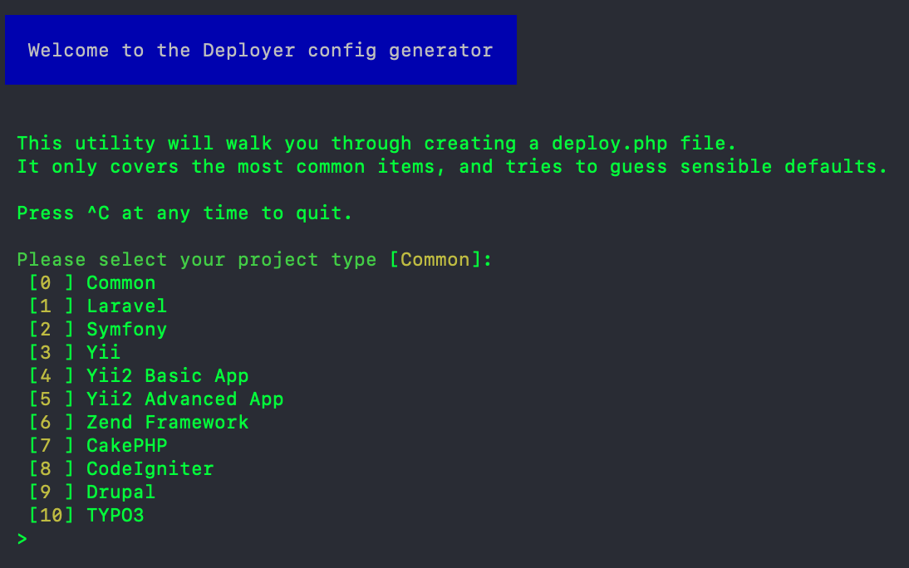
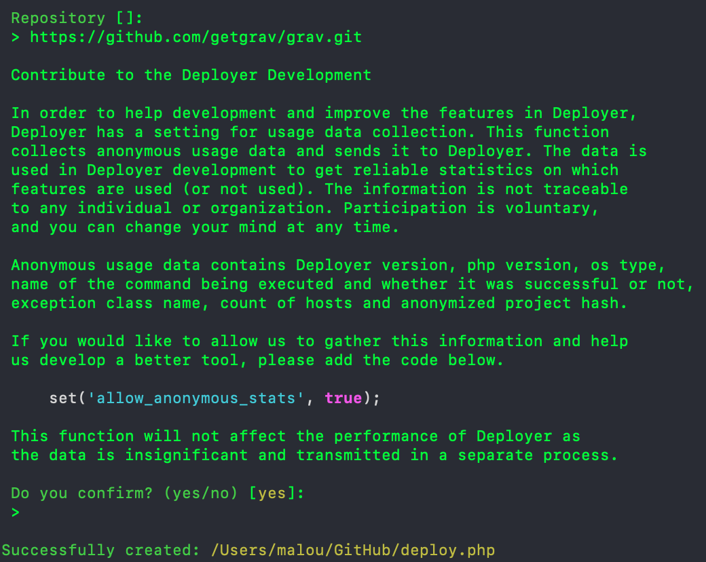
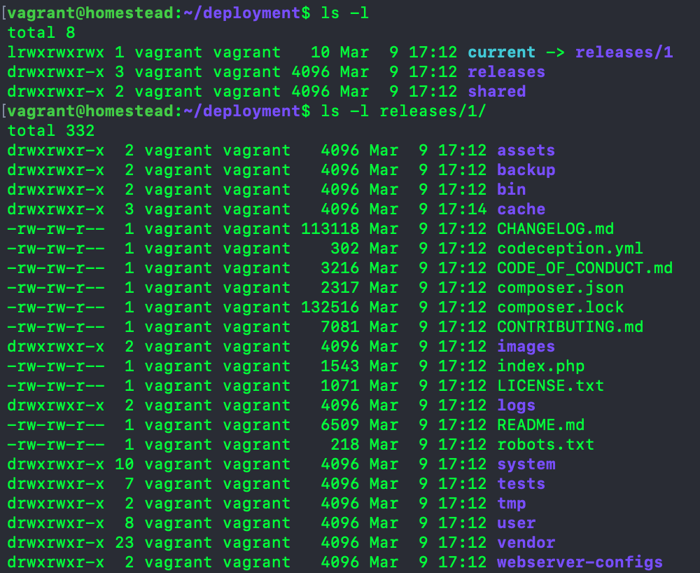
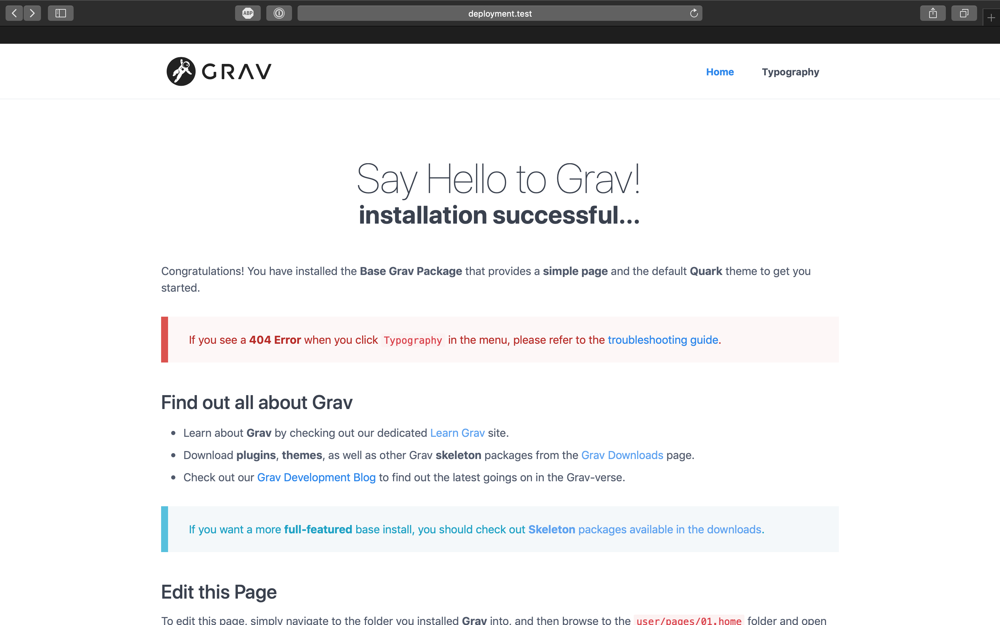
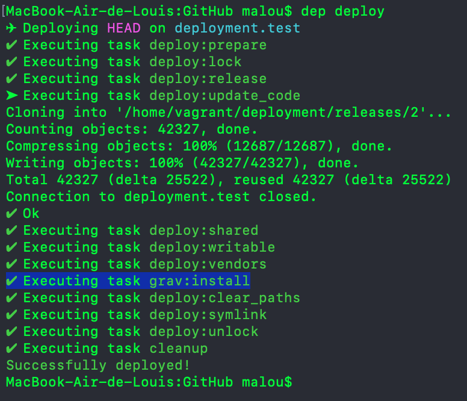
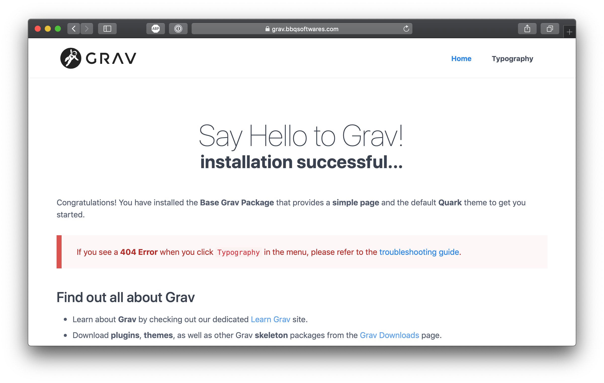

For the pas couple of days, I've been searching for [a way to automatically deploys two Grav based website](/blog/deployment-search) when sending new commits to GitHub. So far, I determined I would be using [Deployer.org](https://deployer.org) for the actual file copying and other installation operations. Let's dig in in this first attempt to see what Deployer can do and if it will be able to answers my needs.

===

## Setting up for testing

### Installing Deployer

First, let's start by installing Deployer on my local machine. I'll use the [phar archive method](https://deployer.org/docs/getting-started.html) :

```
curl -LO https://deployer.org/deployer.phar
mv deployer.phar /usr/local/bin/dep
chmod +x /usr/local/bin/dep
```

[notice=note]On MacOS, I had to add `sudo` to the second command, as my user didn't have permission to write to `/usr/local/bin`[/notice]


### Setting up deployment target

For testing purposes, I wont be deploying to a production server just yet. Since I already have a shared Vagrant Homestead VM up and running, I'll try to deploy to this VM. I started by adding a new domain to my Vagrant config, tied to `/home/vagrant/deployment/current` path on the VM:

```
- map: deployment.test
  to: /home/vagrant/deployment/current
```

I also SSH into the box and created the `/home/vagrant/deployment` directory manually. I didn't map this directory to a local one, as this is not the goal here. I also won't be creating the `/home/vagrant/deployment/current` directory yet, as this will be supposedly handled by Deployer.

After reloading vagrant and adding the domain to my machine `/etc/hosts`, I now have a new host reachable at <http://deployment.test> with IP `192.168.10.10`.

### Code to deploy

I'll test Deployer by cloning [Grav](https://getgrav.org). I don't need a local copy here, only the git repository address :

```
https://github.com/getgrav/grav.git
```


## First deployment script

Let's start by creating a new empty deployment script :

```
$ dep init
```

I'm now presented with a choice. Let's choose the `Common` type for now.



Next it ask for the repo URL. I'll paste the Grav repo url from earlier :



I now have a new default `deploy.php` file :

```php
<?php
namespace Deployer;

require 'recipe/common.php';

// Project name
set('application', 'my_project');

// Project repository
set('repository', 'https://github.com/getgrav/grav.git');

// [Optional] Allocate tty for git clone. Default value is false.
set('git_tty', true);

// Shared files/dirs between deploys
set('shared_files', []);
set('shared_dirs', []);

// Writable dirs by web server
set('writable_dirs', []);


// Hosts

host('project.com')
    ->set('deploy_path', '~/{{application}}');    


// Tasks

desc('Deploy your project');
task('deploy', [
    'deploy:info',
    'deploy:prepare',
    'deploy:lock',
    'deploy:release',
    'deploy:update_code',
    'deploy:shared',
    'deploy:writable',
    'deploy:vendors',
    'deploy:clear_paths',
    'deploy:symlink',
    'deploy:unlock',
    'cleanup',
    'success'
]);

// [Optional] If deploy fails automatically unlock.
after('deploy:failed', 'deploy:unlock');
```

### Setting up the host

Let's start by setting up the host to point to my Vagrant box :

```php
// Hosts
host('deployment.test')
    ->user('vagrant')
    ->set('deploy_path', '/home/vagrant/deployment');
```

I added the `vagrant` user instruction, since this user is already setup with public key for passwordless login.

Let run the deployment script to see what it does :

```bash
$ dep deploy
```


The result can be seen on the target server (the Vagrant box) :



So basically, Deployer will clone the latest version of the code into `releases/` each time `deploy` is run, with a symlink of the latest one to `current/`. See why I pointed the domain to `/home/vagrant/deployment/current` earlier?

Now if I go to <http://deployment.test>, I'll be greeted by this message :

```txt
Theme 'quark' does not exist, unable to display page.
```

That's because we need to actually install Grav, using `bin/grav install`.


### Adding the install task

To run the Grav installation script, we'll need to define a new [**task**](https://deployer.org/docs/tasks.html). Let's add this to our `deploy.php`.

```php
// Grav install task
task('grav:install', 'bin/grav install');
```

We won't run the whole deploy just yet (we didn't even added it to `deploy` yet), we'll run this one task to make sure it works.  

```bash
$ dep grav:install
✔ Executing task grav:install
```

[notice=tip]You can add verbosity (`dep grav:install -vvv`) to see the underlying process.[/notice]

Let's see if our installation was a success :



Yay!

Now we only need to do is add my new custom task to the main deploy one. The deploy task actually bundle multiple sub task together. All those sub task are loaded from the common recipe bundle with Deployer (and loaded by the `require 'recipe/common.php';` line at the top our the `deploy.php` file). [You can learn about them here](https://deployer.org/docs/flow.html). I guess the right place to run the grav install command would be right after `deploy:vendors`. Let's add our new task :

```php
// Tasks

desc('Deploy your project');
task('deploy', [
    'deploy:info',
    'deploy:prepare',
    'deploy:lock',
    'deploy:release',
    'deploy:update_code',
    'deploy:shared',
    'deploy:writable',
    'deploy:vendors',
    'grav:install',
    'deploy:clear_paths',
    'deploy:symlink',
    'deploy:unlock',
    'cleanup',
    'success'
]);
```

...and run `deploy` again :



Here we can see our task successfully after after `deploy:vendors` just like I wanted !

## Testing on the production server

Now it's time to try to deploy to my production server. I've  already setup a new vhost on it (remember to point to `current/`), so let's dig in and edit the Host portion of the `deploy.php` file :

```php
// Hosts
host('deployment.test')
    ->stage('development')
    ->user('vagrant')
    ->set('deploy_path', '/home/vagrant/deployment');

host('bbqsoftwares.com')
    ->stage('production')
    ->user('malou')
    ->set('deploy_path', '/var/www/grav.bbqsoftwares.com');
```

Here you can see I kept the VM host, but tagged it as _development_. The production server is tagged _production_. Deployer allows you to have as many hosts as you wants, and deploy to any one (or all) of them. Let's try deploying to the production server now (finger crossed) :

```bash
$ dep deploy production
✈︎ Deploying HEAD on bbqsoftwares.com
✔ Executing task deploy:prepare
✔ Executing task deploy:lock
✔ Executing task deploy:release
➤ Executing task deploy:update_code
Cloning into '/var/www/grav.bbqsoftwares.com/releases/1'...
remote: Enumerating objects: 71, done.
remote: Counting objects: 100% (71/71), done.
remote: Compressing objects: 100% (48/48), done.
remote: Total 42327 (delta 33), reused 43 (delta 16), pack-reused 42256
Receiving objects: 100% (42327/42327), 14.88 MiB | 5.89 MiB/s, done.
Resolving deltas: 100% (25522/25522), done.
Checking connectivity... done.
Connection to bbqsoftwares.com closed.
✔ Ok
✔ Executing task deploy:shared
✔ Executing task deploy:writable
✔ Executing task deploy:vendors
✔ Executing task grav:install
✔ Executing task deploy:clear_paths
✔ Executing task deploy:symlink
✔ Executing task deploy:unlock
✔ Executing task cleanup
Successfully deployed!
```

Even if the deployment script was a success, I had one small issue: **a white page when I try go to the URL in my browser**. A quick look into Apache logs revealed the problem. Something related to file permissions. Makes sense, as I login with my user (`malou`), but apache uses the `www-data` user.

To fix this issue, I can't simply add a task to change permissions, as even [if everything is owned by `malou`, he can't `chown` the files without `sudo`](https://askubuntu.com/a/217487). I could login as `www-data` instead of `malou`, but that [could create a security issue](https://askubuntu.com/a/46371). Finally, Deployer offers a `writable_dirs` options, which is a "List of dirs which must be writable for web server", but giving write permission to everything it's not exactly what I want.

Long story short, there's a couple ways of fixing this permission issue here, but it's usually a matter of giving the right permissions to the right users and group. [I ended up fixing everything with the _Solution 1_ from this post](https://askubuntu.com/a/46371). And to be fair, permissions can be a pain to manage even when deploying manually...

So now that this is fixed, I have my deployed Grav on my VPS !



## Conclusion

I must say, I'm pretty impressed so far by how Deployer works and is simple to use. When moving on to the real deal, I'll have to manage something clever to be able to deploy my actual Grav website, since I don't keep a copy of Grav itself in [my repo](https://github.com/lcharette/website). Same goes for UserFrosting based sites, which required UserFrosting to be cloned first, then the Sprinkles. However, if I had to guess, I would say it's only a matter of writing the correct tasks. Taking example of the base `deploy:update_code` task might prove helpful in the future.

Next up, I'll be trying [Webhook](/blog/deployment-search#public-facing-hook-endpoint-webhook-travis). Once this is done, I'll finally be able to move on to setup full automated deploying of both my Grav based projects !
