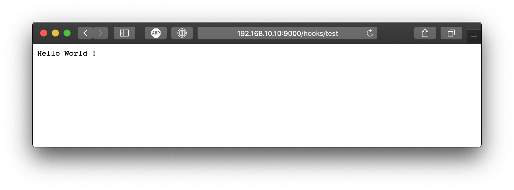
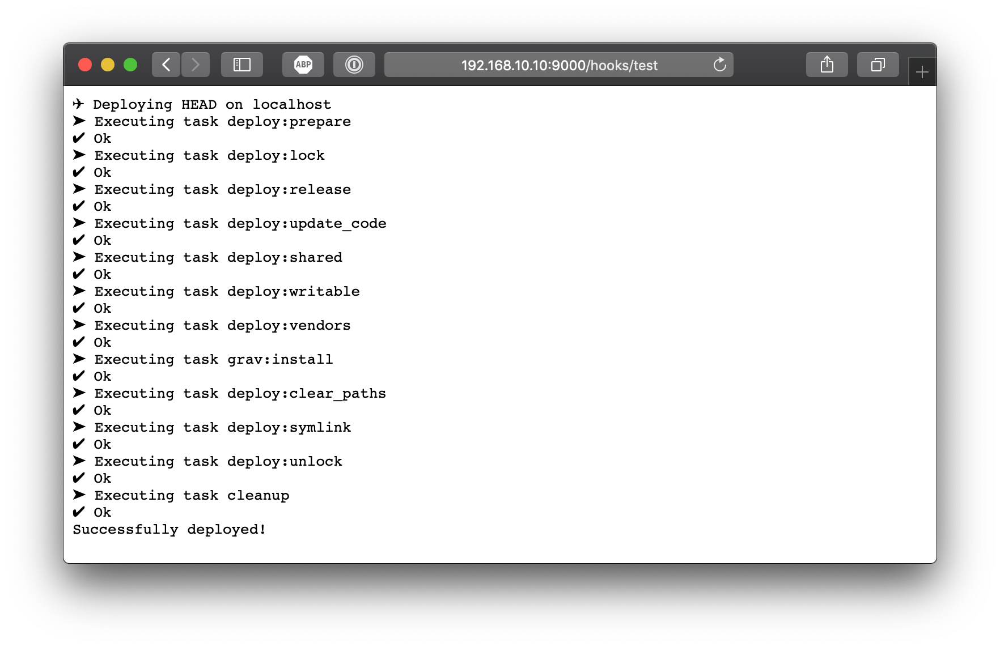
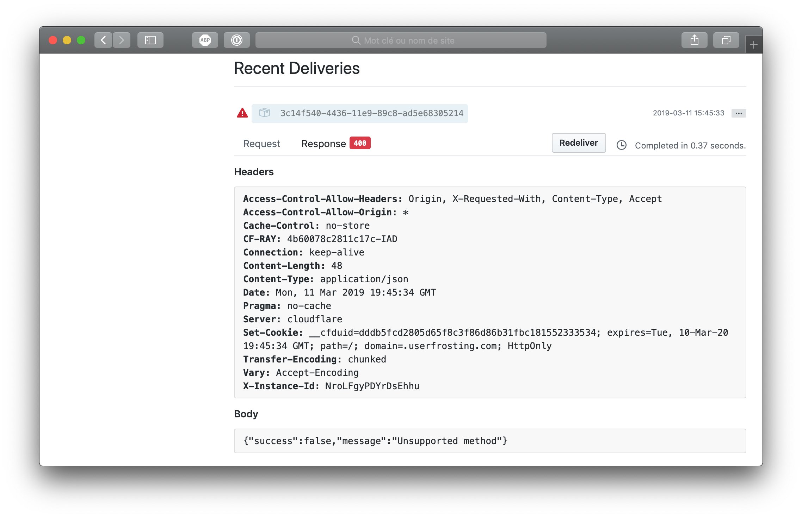

Now that I [tested Deployer](/blog/testing-deployer), which will be responsible for actually installing my sites when [auto deploying](/blog/deployment-search), the only point left to figure out the public URL endpoint. For this part, I'll be testing out [Webhook](https://github.com/adnanh/webhook).

===

[center][](https://github.com/adnanh/webhook)[/center]

## Testing on the VM

Just like the [tests I did with Deployer earlier](/blog/testing-deployer), I'll be testing Webhook on a Vagrant VM first. Obviously, I won't be able to test out GitHub integration just yet.

First, lets login to the VM and install Webhook :

```bash
$ sudo apt-get install webhook
```

It may depends on your install method, but I found out using the `apt-get` method already created a service for me. Nice little touch not in the Readme. You can test if the service is running with this command :

```bash
$ service webhook status
● webhook.service - Small server for creating HTTP endpoints (hooks)
   Loaded: loaded (/lib/systemd/system/webhook.service; enabled; vendor preset: enabled)
   Active: active (running) since Sun 2019-03-10 16:01:06 UTC; 5min ago
     Docs: https://github.com/adnanh/webhook/
 Main PID: 2438 (webhook)
    Tasks: 4 (limit: 2319)
   CGroup: /system.slice/webhook.service
           └─2438 /usr/bin/webhook -nopanic -hooks /etc/webhook.conf
```

If it's not, you can see [this guide](https://davidauthier.com/blog/deploy-using-github-webhooks.html) to setup the service.

I can now see webhook working in the browser at <http://192.168.10.10:9000>, with a `404 page not found` message, which make sense since we didn't define any hook yet.

### Test script

Before defining my first hook, I'll create a small test script:

```bash
$ nano /home/vagrant/test.sh
```

```bash
#!/bin/sh

echo "Hello World !"
```

Makes it executable :

```bash
$ chmod +x /home/vagrant/test.sh
```

And test it :

```bash
$ /home/vagrant/test.sh
Hello World !
```


## Defining the first hook

Ok, so the first question here, is where do I put my hook definitions?

The [documentation](https://github.com/adnanh/webhook#configuration) says to create a `hooks.json` file, then run webhook with that file as argument. But we're running from a preconfigured service... so?

Well, the `service webhook status` command above reveal the answer : `/usr/bin/webhook -nopanic -hooks /etc/webhook.conf`. So **`/etc/webhook.conf`** it is. Let's do a quick `test` hook, which will execute our test script:  

```json
[
  {
    "id": "test",
    "execute-command": "/home/vagrant/test.sh",
    "command-working-directory": "/home/vagrant",
    "include-command-output-in-response": true
  }
]
```

I added the [`include-command-output-in-response` option](https://github.com/adnanh/webhook/blob/master/docs/Webhook-Parameters.md#webhook-parameters) as I want to see the test script output to make sure it works.

Let's see the result in the browser, at <http://192.168.10.10:9000/hooks/test> :

```txt
Hook not found.
```

Hum...

Oh right, we need to restart the service for our new configuration to be read :

```bash
$ sudo systemctl restart webhook
```

Now when I reload the browser...



Success !


## Deploying a script

Now let's switch to a real Deployer deployment. So after installing Deployer on the VM, I'll create a `deploy.php` in `/home/vagrant/`. I'll use the [same deploy script as my previous Grav testing](/blog/testing-deployer), except this time, since it will be executed from the VM itself, not my computer, I need to replace the `host`. To deploy locally, instead of `host(address)`, we can use `localhost()`:

```php
// Hosts
localhost()
    ->set('deploy_path', '/home/vagrant/deployment');
```

Test to make sure it works:

```bash
$ dep deploy
```

Next, I change my test script to the deployer script. First thing to know, `execute command` requires the full path since Webhook doesn't have our `$PATH` defined apparently. Next, any argeument needs to be break down in `pass-arguments-to-command`, this mean our `deploy` argument can't be in `execute-command`:
```json
[
  {
    "id": "test",
    "execute-command": "/usr/local/bin/dep deploy",
    "command-working-directory": "/home/vagrant",
    "include-command-output-in-response": true,
    "pass-arguments-to-command":
    [
      {
        "source": "string",
        "name": "deploy"
      }
    ]
  }
]
```

And don't forget to reload the service:
```bash
$ sudo systemctl restart webhook
```

Now when I reload the page :



So now of course, we won't want to display all of this in a production environment. We can now remove `"include-command-output-in-response": true,` since we're done testing. Plus, when turned off, Webhook won't wait for it to be finished to return a success code, even if the script is taking a couple of second to finish.


## Conclusion

My opinion on Webhook is... well it’s hard to say how I feel about it. It’s definitively not as clear as [my opinion on Deployer](/blog/testing-deployer#conclusion). On one end, Webhook is good at what it does, ie. gaping the void between a shell script and an URL, which is exactly what I need. But on the other hand, the overall solution could be simpler.

Since the `execute-command` property doesn’t accept complex commands with arguments, you are limited in what you can do without cluttering your hook script. Looks like Webhook goal is to run an `.sh` script, which in my case I don’t need as I'm only using Deployer's `dep deploy` command instead. I definitively want to avoid Webhook definition + Deployer + middlescript.

Manually setting up the hook is not that bad, since you would have to setup Apache vhost anyway. But it would be better if we could do exactly like Apache does for vhosts, that is one file per hook, and load every files in a given directory. For example, run having both `/etc/hooks/foo.json` and `/etc/hooks/bar.json`, and loading both with `-hooks ./hooks/` argument. But this doesn't work :

```
$ /usr/bin/webhook -nopanic -hooks ./hooks  -verbose
[webhook] 2019/03/12 01:06:30 version 2.5.0 starting
[webhook] 2019/03/12 01:06:30 setting up os signal watcher
[webhook] 2019/03/12 01:06:30 attempting to load hooks from ./hooks
[webhook] 2019/03/12 01:06:30 couldn't load hooks from file! read ./hooks: is a directory
```

In the end, it might be easier for some people to setup _Apache + frontend PHP script_ that calls Deployer. Webhook doesn’t add much more to this setup, other than being faster and removing the custom script. The perfect solution would be if GitHub could integrate directly with Deployer, either on GitHub side, or deployer side with a built-in service listening for incoming connection.

The deploy script and hook definition still require refinement to be production ready. For example, it would be a good idea to enabled HTTPS for the endpoint, which Webhook does support. We could also proxy the 9000 port to a custom subdomain on port 80 with Apache `mod_proxy`. This might not be required, as long as GitHub can access the URL on the 9000 port, but it's a nice touch.

I also think it would be a good idea to add return statement for easier debugging when integration with GitHub. I’m not sure I want to display everything Depoyer returns, but I do like the idea of returning valid json message on success / failure, so you can see if something went wrong directly from GitHub interface.

[center]

[size=12]Example of GitHub Webhook delivery logging[/size]
[/center]

But this won’t be possible without a middleware script, or changes to Deployer... The other solution would be to return everything, but block usage with a secret key embed in the payload, which would at least hide the result to be publicly visible.


I’ll keep digging and testing Webhook for now, as it’s probably the solution I’ll be using, on my own VPS at least. I also need to go over the [hook properties](https://github.com/adnanh/webhook/blob/master/docs/Hook-Definition.md) and [rules](https://github.com/adnanh/webhook/blob/master/docs/Hook-Rules.md) Webhook provides. There could be something useful in there I missed.

But like I said in the beginning of this conclusion, in the end I don't feel as confident about Webhook as I did with Deployer (after playing with Deployer for less than one hour). Or maybe it's just another proof mixing the CLI with a publicly accessible URL, alongside Apache that is, is a real unresolved issue...
