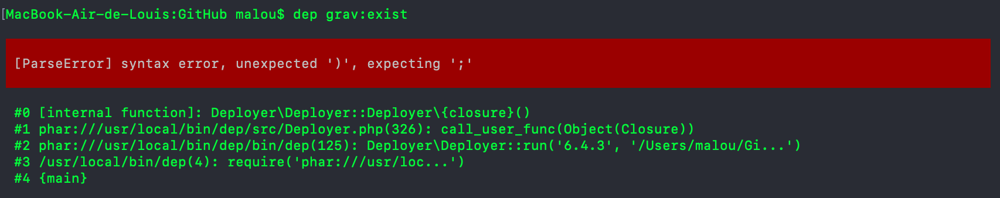
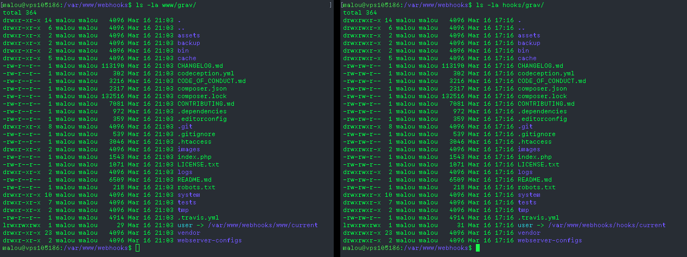

My quest to auto-deploy my Grav-based websites when pushing new commits to GitHub continues. Now that I tested both [Deployer as my deployment script](/blog/testing-deployer) and [Webhook as my incoming hook listener](/blog/testing-webhook), it should be a piece of cake to set all this up on the production server right? Well, guess again...

===

### Deployer

First let's talk about Deployer. The [love story](/blog/testing-deployer#conclusion) didn't last long. While this tool is still pretty awesome, it has a major flaw. **Deployer is designed to deploy single repo project**.

In case of Grav (and eventually UserFrosting), the whole code is not hosted in my GitHub repository, only [the `user/` directory is](https://getgrav.org/blog/developing-with-github-part-2) (or [_sprinkle_](https://learn.userfrosting.com/sprinkles/introduction) in case of UserFrosting). This means deployment of Grav is a two-step process (or two repo process):
1. Clone Grav into `grav/`
2. Clone personal repo into `grav/user`

My initial thought was to reuse Deployer's common `deploy:update_code` task to clone both repo, but this function is [overly complex](https://github.com/deployphp/deployer/blob/master/recipe/deploy/update_code.php#L48-L101), which means it's not an easy task to simply replace one param. Changing the destination or the repository reference simply didn't work. Not a proper OOP class, no proper inheritance.

I ended up copying most of the `deploy:update_code` into my `deploy.php` since I had no other choice. So now my deployment process looks like this :
1. Clone Grav in `site/grav/` (if not already there) using a custom task;
2. Update Grav to latest version;
3. Clone my repo using Deployer built-in task into `site/`;
4. Deployer creates the symlink for the current version `sites/current/`;
5. Create a `/site/grav/user` symlink pointing to `sites/current/` (which itself is a symlink to `site/releases/{id}`);
6. Run `bin/grav install` inside `site/grav/`;
7. Run `bin/grav clear-cache` inside `site/grav/`.

However this method has one big drawback, as Grav is **not** actually in the deployment directory, which means I can't rollback to a previous version of Grav if something goes wrong. Deployer rollback features will only rollback my `user/` directory.

I then came up with the idea of deploying my repository directly into a base Grav install and tell Deployer to use `user/` instead of `current/` for the deployment directory. This will avoid setting up a symlink into a symlink. Problem here is the destination directory (`current/`) is [hardcoded in Deployer and can't be changed using a configuration variable](https://github.com/deployphp/deployer/blob/d898570ad856be7ccfa80ad4a99da855f96c019b/recipe/deploy/prepare.php#L26). So double symlink it is...

At least now I have a somewhat functioning Deployer script. It's not perfect, but it works.

Oh and bonus (negative) points for Deployer. While testing my code, I came across this error:


The actual error was indeed a missing semicolon on line 53 of my `deployer.php` file. Easy to find right? Error management could be better... (that's what you get for using anonymous function everywhere)

### Moving to the production server

Fortunately, setting up Webhook at this point was simple and I got to create my site automatically on my Vagrant VM. Now that I have my Deployer script and Webhook config tested on said VM, I can move on to the production server.

First step, install Deployer and test deployment script. So far so good! Site is visible and working as expected on the production server test subdomain.

Next up, install Webhook on the production server :

```
$ sudo apt-get install webhook
Reading package lists... Done
Building dependency tree       
Reading state information... Done
E: Unable to locate package webhook
```

Hum... Ok this one is on me. My production server was running Ubuntu 16.04 and Webhook [apt package requires 17.04](https://github.com/adnanh/webhook#ubuntu). Time to upgrade to 18.04... Or install manually for now and update later...

Once Webhook installed manually (thanks to the pre-built binaries on the project GitHub repo), it's time to test our first deployment from the callback URL. Let's start by running Webhook manually since I don't have the service setup yet. Again, so far so good. All files are created and site is visible. Let's simulate a new, second deployment.

> Permission error...

Webhook is currently running as my user (`malou`) and cache files must have been created by Apache (aka `www-data`). So it's _only_ a permission thing...

### Permissions nightmare

Here begin the nightmare. Since my user (`malou`) is trying to modify the files owned by `www-data`, of course it won't work. To fix this, it's only a matter of adding my user to the `www-data` group and make everything owned by that group. Once this is done, I reset everything and start from scratch. First deployment works fine. I can access the site perfectly. A look at the filesystem permissions reveals everything is owned by `malou:www-data` as it should.

Second deployment...

> The command "cd /var/www/webhook/grav && (bin/gpm selfupgrade -f) failed.
>
> PHP Fatal error:  Uncaught RuntimeException: Opening file for writing failed on error  in /var/www/webhook/grav/vendor/rockettheme/toolbox/File/src/File.php:198  

Arg...

Turns out one of the cache file is now belonging to `www-data:www-data`, but without group write permission. Lovely. Now `malou` can't do anything.

#### Running Webhook as a Service
Ok, let's move on and setup the Webhook service. Maybe that will help. Once again, I reset everything and start from scratch. Run deployment, everything runs fine. Visit test URL and... **white page of death**.

A quick `ls -la` in the Grav directory reveals the problems. All files and directories are now owned by `root:root`. Makes sense, as the service is started using sudo and Apache can't access anything.

Quick edit to the service definition to [make it run as the `www-data` user](https://askubuntu.com/questions/676007/how-do-i-make-my-systemd-service-run-via-specific-user-and-start-on-boot). But that didn't change anything as apparently root can't elevate itself as the `www-data` user for some reason.

So I tried again using my user. At this point my service looks like this:

```
[Unit]
Description=Small server for creating HTTP endpoints (hooks)
Documentation=https://github.com/adnanh/webhook/

[Service]
User=malou
Group=www-data
ExecStart=/var/www/webhooks/webhook -nopanic -hooks /var/www/webhooks/hooks.json

[Install]
WantedBy=multi-user.target
```

I run the hook again... still a **white page of death**.

Another `ls -la` revels something interesting. While all files are now owned by `malou:www-data`, as they should, they don't have group write permission. Stop the service, run Webhook manually as my user again and confirm the same files do have group write permission. I even tried running the service and using my user as group, with the same result.

[[figure caption="Wehbook service on the left, Webhook run as my user on the right"][/figure]](PermissionsCompare.png)

Wait what? There's probably something going on that I don't understand, but it still doesn't make sense. At least it (kind of) explains why I now have this _white page of death_ in my browser. I probably won't help me fix the second deployment issue just yet, but at least I'm close... I think ?

### Running everything as `www-data` ?

So here I am. I have only solution I can think of right now (with a second being throwing everything out the window) : **Make the service deploy as `www-data` so everything is owned by `www-data:www-data`**.

**But it simply doesn't work**

Even if I tell Deployer to use the `www-data` user :

```
// Hosts
localhost()
    ->become('www-data')
    ->set('deploy_path', '/var/www/grav.bbqsoftwares.com');
```
It has no effect.

If I run the service as `www-data`:

```
[Service]
User=www-data
Group=www-data
ExecStart=/var/www/webhooks/webhook -nopanic -hooks /var/www/webhooks/hooks.json
```

...it returns this message, with nothing in the logs (obviously):

```
Error occurred while executing the hook's command. Please check your logs for more details.
```


**In short, it just does not work**. Every time files either belongs to `root:root` or `malou:www-data` without the group write permission. Any progress I make, I get stuck in a new permission ~~issue~~ nightmare.

[center][/center]

~~At this point, I think I'll sleep on it for a couple of days. You can see my progress so far and the config I am using on [this Gist](https://gist.github.com/lcharette/91edc141d55918a5c2d9589f83c7dc82)...~~

~~Oh and, [let me know](/contact) if you have any ideas I could try.~~


### The Solution...

Literally 5 minutes after pushing this article to GitHub... ~~I had an epiphany~~ I typed the right command by accident (and had to edit this article).

**Running the service as `www-data` didn't worked because the parent directory wasn't writable to this user**.

I was deploying to `/var/www/grav/`, but somehow `/var/www` belongs to `malou:malou`. That's why it (silently) failed. It couldn't create `grav/`. Even when I kept the `grav/` directory and emptied it between test, it was still owned by `malou` from a previous test...

And I actually found the solution by accident. I did a "_last test before I stop working on this for tonight_" test. Deployed using my user (so all files are owned by `malou:www-data` without group write permission), and then change ownership to `www-data:www-data` to see if at least I can get rid of the white page of death. Instead of doing `sudo chown -R www-data:www-data ./*` like I usually do, I used the _long_ way : `sudo chown -R www-data:www-data /var/www/grav`. Boom. Epiphany. Let's try running the service again... And there we are.

Now that `/var/www/grav/` belongs to `www-data:www-data`, the automatic deployment works with the service running as `www-data`. My user won't be able to edit anything, but at this point I don't care. And it's not the point.

I'll write a definitive guide as soon as I tested a bit more this solution and get some sleep, in case it's still a false positive. And this update will actually be a real life test of deployment on git push, so wish me luck. Meanwhile, you can see the working scripts on [this Gist](https://gist.github.com/lcharette/91edc141d55918a5c2d9589f83c7dc82)...
