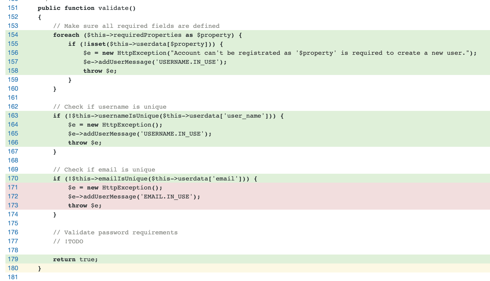

I'm all caught up in Unit Testing and Code Coverage theses days and while I plan on writing more on it later, I recently came across the perfect example of why you shouldn't trust a test and how code coverage can help you avoid false positive.

===

### The code to test

So here's the method I was testing, from UserFrosting's [Registration class](https://github.com/userfrosting/UserFrosting/blob/d312d1f054c11d4bec011935042f154a0ec63003/app/sprinkles/account/src/Account/Registration.php#L151-L180) :

```php
public function validate()
{
    // Make sure all required fields are defined
    foreach ($this->requiredProperties as $property) {
        if (!isset($this->userdata[$property])) {
            $e = new HttpException("Account can't be registrated as '$property' is required to create a new user.");
            $e->addUserMessage('USERNAME.IN_USE');
            throw $e;
        }
    }

    // Check if username is unique
    if (!$this->usernameIsUnique($this->userdata['user_name'])) {
        $e = new HttpException();
        $e->addUserMessage('USERNAME.IN_USE');
        throw $e;
    }

    // Check if email is unique
    if (!$this->emailIsUnique($this->userdata['email'])) {
        $e = new HttpException();
        $e->addUserMessage('EMAIL.IN_USE');
        throw $e;
    }

    return true;
}
```

The important code is the second and third blocks. The second one make sure someone doesn't want to register a new account with an existing username (with the `usernameIsUnique` protected method). The third block make sure the someone doesn't want to register a new account with an existing username (with the `emailIsUnique` protected method).


### The tests

A unit test for this class [was already available](https://github.com/userfrosting/UserFrosting/blob/d312d1f054c11d4bec011935042f154a0ec63003/app/sprinkles/account/tests/Unit/RegistrationTest.php) and provided (incomplete) test for the register and validate methods. Let's focus on the original `testNormalRegistration` test. First, a new user is registered, because we do need at least one registered user to test if a username or email is unique or not. This first part of the test method register a new user, test the registration class, test the Registration class `register` public method and finally test the returned value.

```php
// Generate user data
$fakeUserData = [
    'user_name'     => 'FooBar',
    'first_name'    => 'Foo',
    'last_name'     => 'Bar',
    'email'         => 'Foo@Bar.com',
    'password'      => 'FooBarFooBar123'
];

// Get class
$registration = new Registration($this->ci, $fakeUserData);
$this->assertInstanceOf(Registration::class, $registration);

// Register user
$user = $registration->register();

// Registration should return a valid user
$this->assertInstanceOf(UserInterface::class, $user);
$this->assertEquals('FooBar', $user->user_name);
```

So far so good. Next, **in the same test method**, we add this part to test `usernameIsUnique`. Since we pass the same `$fakeUserData`, it will throw an exception:

```php
// We try to register the same user again. Should throw an error
$registration = new Registration($this->ci, $fakeUserData);
$this->expectException(HttpException::class);
$validation = $registration->validate();
```

Finally, we change the username so it's now unique and run the validation again. It will now throw an exception on `emailIsUnique`:

```php
// Should throw email error if we change the username
$fakeUserData['user_name'] = 'BarFoo';
$registration = new Registration($this->ci, $fakeUserData);
$this->expectException(HttpException::class);
$validation = $registration->validate();
```

Looks fine right? The tests sure are successful.

Let's look at test coverage :



See how lines 171 to 173 are not tested ?

### But why ?

This a perfect example of a test that appears to be fine, but in fact isn't actually running. We have here a perfect example of a **false positive test**, because even if the test result is green and the assertions seem successful, the coverage report shows the last `expectException` assertion was never actually tested. And without the coverage report, there's no way to know it's not working.

Now why is the email test not executed? One of the reasons is related to the way PHPUnit handles the `expectException` assertion. When working with [multiple Exception in the same method](https://stackoverflow.com/a/1600307/445757), the second `$registration->validate();` won't be triggered because the first one, the one that thrown an exception, will silently stop the test method execution.

If you want to confirm our second Exception is not run in the example above, you can comment the second `$this->expectException(HttpException::class);`, which should theoretically produce an error. You can even throw in some exception message assertion with `expectExceptionMessage` and different messages for both exception in the Registration class. In both cases, the second exception won't produce any failed tests.

The size of the test method is another factor to consider, and this is true for any test. Long test is generally not a good idea as more complexity can produce this kind of false positive. The green result when executing all test will tell you _a test in the method_ was successful (or not), but won't tell you if they actually all ran. Add a `exit;` in the middle of a test method if you want to experience this.


### The solution

So to make sure our tests cover both exceptions, it's only a matter of separating them into multiple test methods. Before doing this, we need to understand why it's been written as a single method in the first place. This is because UserFrosting test environment uses in memory database for testing and this database _can_ be reset between tests. And not only reset between test classes, but between test methods too.

The [initial test](https://github.com/userfrosting/UserFrosting/blob/d312d1f054c11d4bec011935042f154a0ec63003/app/sprinkles/account/tests/Unit/RegistrationTest.php) was using a single test method because we need at least one user to test our unique username and email constraint. Now, because the db is reset between tests by `$this->refreshDatabase()`, if we were to blindly separate the three tests (user, unique username & unique email) into three methods, we would need to create the user in each test.

This doesn't look efficient as we could reuse the same user (and thus same database) between tests (because resetting the db between test takes time and resources). Well, turns out it's not as simple. Since UserFrosting uses an in-memory database, the db **will** be flushed anyway between each test, even if we don't call `$this->refreshDatabase()`. So now we get into a nice little dead end. We can't have the two assertions in the same test and we can't preserve the database between the two tests.

One way to avoid this loop would be to place each exception into a try catch. While it would technically work and avoid resetting the database two extra times, it is, in my opinion, uglier and a wacky way to achieve the goal.

In the end, I ended up simply reusing the main test (the one that creates the first user) into the other sub-tests :

```php
    public function testNormalRegistration()
    {
        // Generate user data
        $fakeUserData = [
            'user_name'     => 'FooBar',
            'first_name'    => 'Foo',
            'last_name'     => 'Bar',
            'email'         => 'Foo@Bar.com',
            'password'      => 'FooBarFooBar123'
        ];


        // Get class
        $registration = new Registration($this->ci, $fakeUserData);
        $this->assertInstanceOf(Registration::class, $registration);

        // Register user
        $user = $registration->register();

        // Registration should return a valid user, with a new ID
        $this->assertInstanceOf(UserInterface::class, $user);
        $this->assertEquals('FooBar', $user->user_name);
        $this->assertInternalType('int', $user->id);

        // Make sure the user is added to the db by querying it
        $users = User::where('email', 'Foo@Bar.com')->get();
        $this->assertCount(1, $users);
        $this->assertSame('FooBar', $users->first()['user_name']);
    }

    /**
     * @depends testNormalRegistration
     * @expectedException UserFrosting\Support\Exception\HttpException
     * @expectedExceptionMessage Username is already in use.
     */
    public function testValidationWithDuplicateUsername()
    {
        // Create the first user to test against
        $this->testNormalRegistration();

        // Generate user data
        $fakeUserData = [
            'user_name'     => 'FooBar',
            'first_name'    => 'Foo',
            'last_name'     => 'Bar',
            'email'         => 'Foo@Bar.com',
            'password'      => 'FooBarFooBar123'
        ];

        // We try to register the same user again. Should throw an error
        $registration = new Registration($this->ci, $fakeUserData);
        $validation = $registration->validate();
    }

    /**
     * @depends testNormalRegistration
     * @expectedException UserFrosting\Support\Exception\HttpException
     * @expectedExceptionMessage Email is already in use.
     */
    public function testValidationWithDuplicateEmail()
    {
        // Create the first user to test against
        $this->testNormalRegistration();

        // Generate user data
        $fakeUserData = [
            'user_name'     => 'BarFoo', //Different user_name
            'first_name'    => 'Foo',
            'last_name'     => 'Bar',
            'email'         => 'Foo@Bar.com',
            'password'      => 'FooBarFooBar123'
        ];

        // Should throw email error if we change the username
        $registration = new Registration($this->ci, $fakeUserData);
        $validation = $registration->validate();
    }
```

The [final test](https://github.com/userfrosting/UserFrosting/blob/6b3e81f2597fff45f570a59fdf0aff865a142707/app/sprinkles/account/tests/Unit/RegistrationTest.php#L97-L154) now uses `$this->testNormalRegistration();` to recreate the user in both `testValidationWithDuplicateUsername` and `testValidationWithDuplicateEmail`. I also moved the exception assertion to the `@expectedException` annotation for cleaner code.

[notice=tip]**Update**: As Sebastian Bergmann, the guy behind PHPUnit itself, [pointed out to me](https://twitter.com/s_bergmann/status/1114077279355850752), the [Exception annotation are deprecated in PHPUnit 8 and will be removed in 2020 with PHPUnit 9](https://thephp.cc/news/2019/02/help-my-tests-stopped-working#expecting-exceptions). So I’ll revert back to the full assertions in the next commit. I haven’t been aware of this yet because I’m still working with PHPUnit 5 as [I still require PHP 5.6 support](https://media.giphy.com/media/4pMX5rJ4PYAEM/giphy.gif).[/notice]


While this doesn't solve the code efficiency issue of resetting the db twice for no reason, it does solve the initial issue of the **false positive tests** by making sure both exceptions are properly thrown. Looking at the code coverage now confirms all lines of the `validate()` method are now covered.


As for the efficiency issue, maybe optimizing the db creation could be more useful. More on that in a future post...
