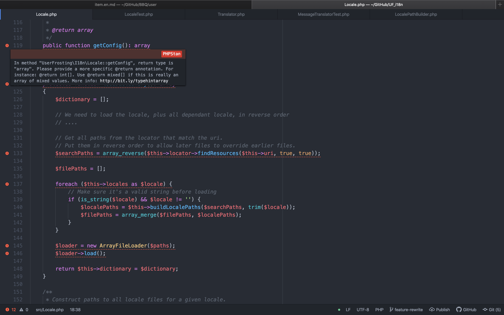

For a while now, I've been using the great Serenata package alongside Atom as a PHP IDE.

===

[center][/center]

[Serenata](https://serenata.gitlab.io) includes many features, such as code autocompletion, code navigation, tooltips, refactoring, signature help and linting. The linting part is very useful to me, as it points out directly in the editor minor code issues like missing semicolon, unavailable class reference, missing docblock, etc. Unfortunately, since version 5 of Serenata, the linting part has been removed. Serenata developer [explained the change](https://gitlab.com/Serenata/Serenata/wikis/Linting) by saying several existing tools do most of what Serenata does, and will likely evolve further in the future.

So following the recommendation from Serenata's author, I tested [PHPStan](https://github.com/phpstan/phpstan). Installation is pretty simple, as long as you already have **Composer** installed on your computer. I installed globally so it would be accessible for all my projects and used the _shim_ version, which provide a self-contained phar archive to avoid a conflict with other composer packages.

```
composer global require phpstan/phpstan-shim
```

[notice=note]
I had to put back the composer global bin dir to my $PATH, as it apparently got wiped out when upgrading to MacOS Catalina:

```
export PATH="$HOME/.composer/vendor/bin:$PATH" >> ~/.bash_profile
```

This might be different if the new zsh shell is active.
[/notice]

As for the Atom part, I installed [atom-linter-phpstan](https://github.com/AtomLinter/atom-linter-phpstan). This Atom package provides integration with the editor, showing you errors

[](AtomPHPStan.png)

My first impressions where that PHPStan was missing out on some errors Serenata used to flag. Fortunately, PHPStan provides a simple way to add new rules, called extensions. The following extension are the one I'm currently using :

- [Extension Installer](https://github.com/phpstan/extension-installer) (Dependency for automatically loading other extensions)
- [PHPStan Strict Rules](https://github.com/thecodingmachine/phpstan-strict-rules)
- [PHPStan Deprecation Rules](https://github.com/phpstan/phpstan-deprecation-rules)

Theses extensions can be installed with composer, again, globally :

```
composer global require phpstan/extension-installer thecodingmachine/phpstan-strict-rules phpstan/phpstan-deprecation-rules
```


Overall, I'm pretty satisfied with the new solution. The rules added by `thecodingmachine/phpstan-strict-rules` are pretty strict, but I prefer to see minor style and documentation "errors" I can ignore than not to see others more important errors I do want to enforce.

It still lack some feature Serenata had, such as removing unused class import (but `php-cs-fixer` can take care of that afterward) and pointing missing docblock arguments definitions (PHPStan won't yell at you if the type hint is present... I prefer to have both).

Now, back to coding !
