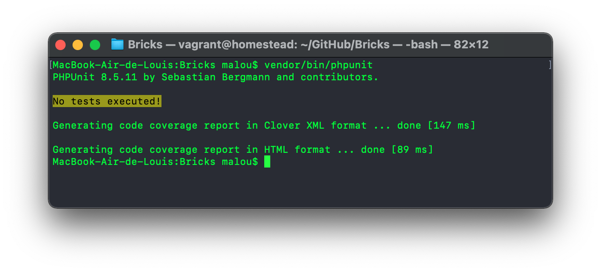
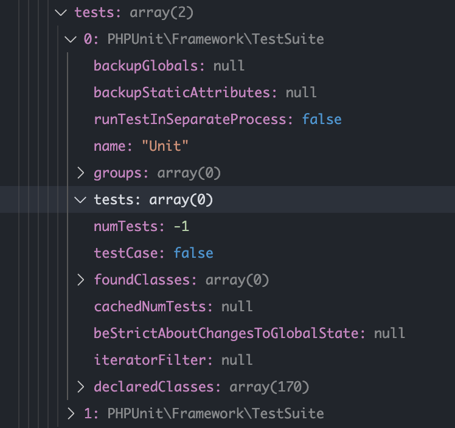

I feel kind of privileged. I always end up with rare and complex issues to solve when developing on MacOS. After getting a crazy amount of reputation on Stackoverflow for [the Xdebug on Catalina conundrum](/blog/xdebug-catalina), this time a yet undocumented failure with PHPUnit arose. But again, I do like a good puzzle. Installing PHP with Homebrew or doing a clean install of MacOS could have been an easy fix on this one, but something in me couldn’t leave the question unanswered. 

===

I’ve always had a talent and a lot of patience for debugging code. Nowadays we have even more tools to do so, and my knowledge as expanded in the last years on how to use those tools. I'm talking about you, Xdebug (_Yes, I love you too Xdebug._). It’s easier than ever for me now to investigate a good old coding mystery. And I think it's important to share my process in solving this issue, as we’re too often jumping or sharing the answer and not the journey that brought us to that answer. 

If just one person learns from this post, I will be happy. 

This post is long, so bear with me. If you’re only interested in the cause of the issue or the direct solution, I won't judge you if you [skip ahead](#the-cause). But if you're a bit curious, I encourage you to continue. I'll even send you a (virtual) trophy if you find the cause before the end !

## The issue

The issue arose when running some PHPUnit tests on my MacBook. After working on the Vue.js UI of my current project for a while, it was time to come back to the backend to implement a new feature. New feature means creating new feature tests and running them locally on my machine, which uses the built-in PHP executable from MacOS. 

Even before coding anything new, let's make sure everything already in place still works first : 

[center][/center]

`No tests executed!`? That's odd. For those who don't understand, at this point, some tests _should have been_ executed, with the number of assertions displayed. 

Now, I haven't used PHPUnit locally on this machine in a while, but it _used to work_. Some dependencies might have been updated since, and I did upgrade to MacOS Big Sur since as well as installing (then uninstalling) Homebrew for unrelated reasons, but it **did** work before. 

I was pretty sure the actual tests and PHPUnit configuration were fine. After all, the tests were running fine on Github Action. I fired up my trusty Homestead Vagrant Box, ran the tests from the exact same folder, and what would you know, it worked fine in the Ubuntu VM.

[center][/center]


## The debugging

### PHPUnit

After some tinkering, I found the PHPUnit config file, `phpunit.xml`, was correctly being used. A simple `vendor/bin/phpunit -v` confirmed this : 

```bash
$ vendor/bin/phpunit -v
PHPUnit 8.5.12 by Sebastian Bergmann and contributors.

Runtime:       PHP 7.3.22-(to be removed in future macOS)
Configuration: /Users/malou/GitHub/Bricks/phpunit.xml

No tests executed!
```

The tests themselves were fine too, as referencing the test folder was producing the expected result with an assertion being processed. At least I had a workaround now to continue working while finding a solution.

```bash
$ vendor/bin/phpunit -v ./tests/Unit
PHPUnit 8.5.12 by Sebastian Bergmann and contributors.

Runtime:       PHP 7.3.22-(to be removed in future macOS)
Configuration: /Users/malou/GitHub/Bricks/phpunit.xml

.                                             1 / 1 (100%)

Time: 00:00.006, Memory: 8.00 MB

OK (1 test, 1 assertion)
```

But trying to run one of the two test suites (with `--testsuite Unit`, which was pointing to the `./tests/Unit` directory) resulted back in the `No tests executed!` error. Mystery, mystery...

```bash
$ vendor/bin/phpunit -v --testsuite Unit
PHPUnit 9.4.4 by Sebastian Bergmann and contributors.

Runtime:       PHP 7.3.22-(to be removed in future macOS)
Configuration: /Users/malou/GitHub/Bricks/phpunit.xml

No tests executed!
```

### PHP Versions, dependencies and case sensitivity

So now, both MacOS and the Homestead VM are running php 7.3. Well, technically PHP 7.3.22 for MacOS and PHP 7.3.23 for VM to be precise, but that shouldn't matter. Both were also using the same version of PHPUnit, and shared the exact same dependencies. So at this point, the PHP version and all the dependencies version could technically be ruled out.

The only real difference is **the OS**. One is obviously MacOS Big Sur, version 11.0.1 to be precise, while the other is Ubuntu 20.04. The difference might be the type of file system used? One of them must be case sensitive and the other not. Ok, so let's look at all paths again to be sure we have the correct case everywhere.

My `phpunit.xml` is basically the [default Laravel one](https://github.com/laravel/laravel/blob/3923e7f7c40368a5e78c1a33610191be8ad91e3b/phpunit.xml#L7-L14) : 

```xml
<testsuites>
    <testsuite name="Unit">
        <directory suffix="Test.php">./tests/Unit</directory>
    </testsuite>
    <testsuite name="Feature">
        <directory suffix="Test.php">./tests/Feature</directory>
    </testsuite>
</testsuites>
```

Now compare this with the directory structure : 

[center][/center]

1. `tests`, no capital, plural? **Check**
2. `Unit`, capital U? **Check**
3. `Test.php` suffix, capital T? **Check**

Humm... that's not it then. _\*sad face\*_

### Reproducing and isolating the error

When faced with this kind of issue that looks like _complete nonsense_, it's important to dig deep into **each** element that could influence the result, and test each, one by one, to determine which can cause this error. Replicating the issue in a clean environment is also a good plan. The simpler this environment is, the better. 

Let's start by making sure the `phpunit.xml` is not the culprit. Easiest thing to test : _"Could it be the suffix config, or the test suite name?"_. I first changed my test suites like this : 

```xml
<testsuite name="foo">
    <directory>./tests/Unit</directory>
</testsuite>
```

Running `vendor/bin/phpunit --testsuite foo` didn't fix it. Renamed the directory from `tests/Unit` to simply `foo`, same result, no tests executed. 


Let's try another framework, just to be sure. I have a copy of UserFrosting installed. After a quick `composer update`: 

```bash
$ app/vendor/bin/phpunit -v
PHPUnit 8.5.11 by Sebastian Bergmann and contributors.

Runtime:       PHP 7.3.22-(to be removed in future macOS) with Xdebug 2.7.0
Configuration: /Users/malou/GitHub/UserFrosting/phpunit.xml

No tests executed!
```

Well, well, well... It's **definitely** something wrong with the OS... or PHPUnit itself. 


I then managed to found the simplest way to reproduce, and at the same time test a newer version of PHPUnit, 9.4, since the other tests were all on PHPUnit 8.5. This called to install a fresh instance of Laravel and running the default tests :

```bash
$ composer create-project --prefer-dist laravel/laravel blog
$ cd blog
$ vendor/bin/phpunit
PHPUnit 9.4.4 by Sebastian Bergmann and contributors.

No tests executed!
```

The expected output would be `OK (2 tests, 2 assertions)` here.

Ok, so at this point, I was 100% sure **this wasn't a PHPUnit issue** since the default Laravel code is expected to work, same goes for UserFrosting, the same issue is present with different PHPUnit version (8.5 and 9.4) and the exact steps listed above return the expected output inside an Ubuntu VM as well as on another Mac running Catalina (because yes, I did try that too !).  I was now convinced it was **a MacOS issue _or_ a PHP configuration issue**, one that could manifest in other forms later with another tool or project (scary !). 

I mentioned installing and removing Homebrew? Let's try reinstalling it. Yeah, I was this desperate. But still no tests were executed...

Having try everything I could think of, as well as googling the error in many different forms, I was stumped, and getting frustated. The only thing I hadn't tried at that point was debugging PHPUnit itself. Before doing that, I posted the issue on Stackoverflow ([PHPUnit always output “No tests executed!” on MacOS Big Sur](https://stackoverflow.com/questions/65064182/phpunit-always-output-no-tests-executed-on-macos-big-sur)) in case someone had an idea. I even [Tweeted](https://twitter.com/LouisCharette/status/1333917453865390080) to PHPUnit's Sebastian Bergmann just in case.

### Xdebug to the rescue !

Some interesting suggestions were shared in the comments on Stackoverflow (after not believing me my `phpunit.xml` was fine). One of which was listing the test suite, something I hadn't tried before:

```bash
$ vendor/bin/phpunit --list-suites
PHPUnit 9.4.4 by Sebastian Bergmann and contributors.

Available test suite(s):
 - Unit
 - Feature
```

So it appears the issue is PHPUnit can read the 'testsuites' from the xml config, but somehow can't link them to the actual directory. It was time to dig inside PHPUnit code. [Total Pusher](https://stackoverflow.com/users/9435985/total-pusher) (thanks btw!) pointed me to the right starting place, going into [`PHPUnit\TextUI\Command::main();`](https://github.com/sebastianbergmann/phpunit/blob/57dd96ec2cc428a58404afe9e5331a1dc2547810/src/TextUI/Command.php#L161) to make sure the command line arguments were correctly being picked up (they were). 

Having [Xdebug integrated in VSCode](/blog/vscode) is really a powerful tool. Go learn how to use it. I'll wait. Back so soon? Great! 

[center][/center]

From there, I began adding breaking points, and following the code until I got where the tests are actually being executed. I ended up in [`PHPUnit\Framework\TestSuite\run();`](https://github.com/sebastianbergmann/phpunit/blob/57dd96ec2cc428a58404afe9e5331a1dc2547810/src/Framework/TestSuite.php#L527), where the test were supposed to be executed and where not. As you can maybe see in the screenshot above, a simple `if (\count($this) === 0) { return $result; }` is used by PHPUnit to abort in case no tests are found. So then it's a matter of the testsuite not being read correctly, as `$this` which represent my `Unit` testsuite was indeed showing an empty `tests` array in the Xdebug window, as well as a `numTests` of `-1` :

[center][/center]

I'll spare you the details here, but from there, I began looking where that array is being defined. I added a new top lever breakpoint, and dug down from there.

## The cause

After following the breadcrumbs with Xdebug for a while, I ended up in PHPUnit [`src/Util/Configuration.php::satisfiesPhpVersion();`](https://github.com/sebastianbergmann/phpunit/blob/ccbf3962a948112056b0eded6e4c880af4ee3695/src/Util/Configuration.php#L1041-L1055). 

```php
private function satisfiesPhpVersion(DOMElement $node): bool
{
    $phpVersion         = \PHP_VERSION;
    $phpVersionOperator = '>=';

    if ($node->hasAttribute('phpVersion')) {
        $phpVersion = (string) $node->getAttribute('phpVersion');
    }

    if ($node->hasAttribute('phpVersionOperator')) {
        $phpVersionOperator = (string) $node->getAttribute('phpVersionOperator');
    }

    return \version_compare(\PHP_VERSION, $phpVersion, (new VersionComparisonOperator($phpVersionOperator))->asString());
}
```

When looking at the last line of PHPUnit's code above (and since both `$node->hasAttribute('phpVersion')` and `$node->hasAttribute('phpVersionOperator')` return false), the return statement can be simplified to: 

```php
version_compare(\PHP_VERSION, \PHP_VERSION, '>=')
```

**That's when _everything_ finally made sense**. 

You see, it's actually been around in the previous output example, in this text : 

[center][/center]

Because the version of PHP that ships with MacOS got deprecated in Big Sur, Apple actually added a warning in the version number. The `\PHP_VERSION` constant was literally returning `7.3.22-(to be removed in future macOS)`. **This is what caused the issue**, as the above `version_compare` now becomes : 

```php
version_compare("7.3.22-(to be removed in future macOS)", "7.3.22-(to be removed in future macOS)", '>=')
```

**Which returns false instead of true.**

A simple way to test this : 

```php
$foo = version_compare("7.3.22-(to be removed in future macOS)", "7.3.22-(to be removed in future macOS)", '>=');
var_dump($foo); // bool(false)

$bar = version_compare("7.3.22", "7.3.22", '>=');
var_dump($bar); // bool(true)
```

That is probably because, as explained in the [official PHP Documentation](https://www.php.net/manual/en/function.version-compare.php)...

> The function first replaces _, - and + with a dot . in the version strings and also inserts dots . before and after any non number so that for example '4.3.2RC1' becomes '4.3.2.RC.1'. Then it compares the parts starting from left to right. If a part contains special version strings these are handled in the following order: any string not found in this list < dev < alpha = a < beta = b < RC = rc < # < pl = p. This way not only versions with different levels like '4.1' and '4.1.2' can be compared but also any PHP specific version containing development state.

> Note that pre-release versions, such as 5.3.0-dev, are considered lower than their final release counterparts (like 5.3.0).

...the naming scheme Apple used is _probably_ treated as a pre-release version, inferior to itself instead of being equal to itself. 

_Apple broke PHPUnit..._ 

(Well, we could also argue agains't PHPUnit code too, but. ok..)

## The solution

So the fix would to overwrite the PHP version number so the constant `\PHP_VERSION` returns only `7.3.22` like it should be. The problem is, as far as I know, it can't be done without recompiling PHP ([let me know if I'm wrong !](/contact)). **Using another instance of PHP will fix this issue.**

Now, to actually do that... Look, I’ve never been a big fan of **Homebrew**. I’ve always found Homebrew to be "_bloated_", with my Mac feeling _dirty_ at each command that poured cask and whatnot. Ew. Could I feel this way because Homebrew install stuff all around you know where, deep in the filesystem? 

But I have to admit, with Apple deprecating PHP on MacOS, it’s still the fastest and easiest way to get up and running. And we might as well get used to it as the next major version of MacOS won't ship with PHP at all apparently. I was planning to compile my own version of PHP for the fun of it in preparation of PHP removal from MacOS, but that plan got thrown away now. Homebrew, I don't like you, and you probably DO like me, but you do make this transition _easy_ :

```bash 
$ brew install php@7.4
$ echo 'export PATH="/usr/local/opt/php@7.4/bin:$PATH"' >> ~/.bash_profile
$ echo 'export PATH="/usr/local/opt/php@7.4/sbin:$PATH"' >> ~/.bash_profile
$ pecl install xdebug
```

[center][/center]

[notice=note]`brew install php` will install PHP 8 at the time I wrote this. While it's nice, PHP 8 has not been around long yet, and for me, PHP 7.4 was a better choice. Also, PHPUnit doesn't support code coverage on PHP8 _yet_. This is why I used `brew install php@7.4`. 

Note you won't need to add PHP to your path if you do install PHP8 with Homebrew, as the same steps as PHP 7.4 can be used to install 7.3 (just replace 7.4 with 7.3 everywhere).[/notice]

I've opened an issue with Apple on their feedback assistant, but I don't have much hope at this point they will actually fix this and renamed PHP in the next updates. I mean, it's such a small issue that will affect a small number of users compared to the global MacOS user base. But we'll see. We never know. 

And it's kind of ironic thought. The first paragraph of this post mentioned installing another version of PHP with Homebrew would have been an easy fix. At lest we did solve the mystery and we **did** learn something in the process, didn't we ?

