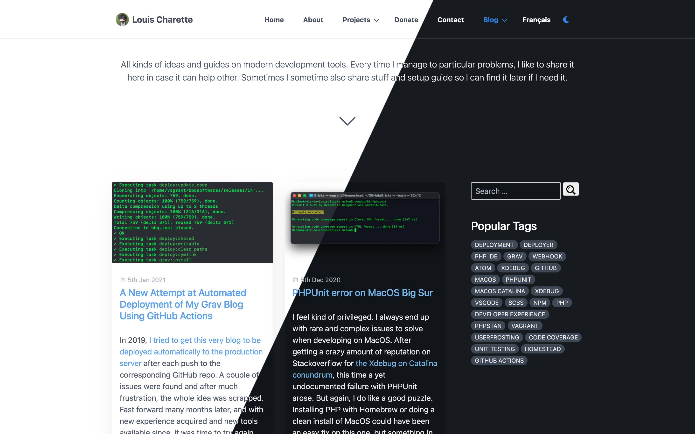

The latest trend theses days in user interface design is definitely dark mode. I’m personally a big user of dark themes. I use it on my MacBook, iPhone, VSCode, GitHub and pretty much everywhere I can activate it. I find it can be easier on eye strain when working long hours in front of a screen like I do.

===

[center][/center]

My preferred editor to write, especially for theses blog posts, is Dropbox paper. The dark mode on the desktop app (when you can find it (spoiler alter, you have to click the “?” on the bottom right corner)) and it minimalist interface is perfect for writing and focussing on what you’re working on. So naturally, after the last blog post where the actual blog was sitting there all bright on my second screen, I wanted to create a dark version for it. 

## Finding a Grav Theme

First problem, this blog is powered by Grav and I’m using the default theme, Quark, which is not available in a dark variant, so I had to create my own… well, that’s technically not true, as I later found [DarkQuark Theme][4] on GitHub (after creating my own dark variant). 

But still, I couldn’t use it *out of the box* anyway because I wanted to offer both variants on this website because, well, I do like it in light mode too! I know some people don’t like this dark trend it’s ok and I also wanted to offer both because, you know, it wasn’t a simple task and I like a good challenge. 

Second problem, Grav doesn’t support *on the fly* theme switching. Sure different pages can have a different theme, but the same page can’t have two themes. I’m also a big fan of Grav’s theme inheritance, something that *DarkQuark* doesn’t make use of enough, in my opinion. Finally, my site does use a personalized version of quark (that I imaginatively called ‘quark-custom`) so the same changes would have needed to be ported over to the other. In the end, it wasn’t much work anyway to get the dark variant up and it allowed heavily influence it by *Dropbox Paper* dark theme, since I like it so much.

So what do we actually need to do this? 

1. Create our dark theme CSS
2. Crete a script to switch from one variant to the other
3. Add a switch to change the theme

Seems easy enough? Let’s dive right in !

## Creating the Dark Bariant in CSS

So first step was to create the actual theme using css. There are multiple methods to apply a style to the entire page in css. You can use a specific class on the `body` element, use a separate stylesheet, use css variables or use a server side script. First of all, the server side script is out here, as it would be too complicated to implement in Grav and requires the page to be reloaded when the theme is changed. I recommend [this guide from CSS-Tricks](https://css-tricks.com/a-complete-guide-to-dark-mode-on-the-web/#toggling-themes) is you want to know more on the different method and detailed how-to on getting dark mode on the web.

I used the ‘body class method’ as it was my first instinct and since I was already using [Sass](https://sass-lang.com) for the custom theme, it would be relatively easy to wrap every element in the `.dark-mode` rule set.

First step is to create a `darkMode.scss` file in your theme directory with an enveloping `body.dark-mode` rule set : 

    body.dark-mode {
     /* Code goes here */
    }

Again, since I’m using Sass, all rule sets can be nested inside this one and Sass will automatically create the appropriate css once the file is compiled. 

From there it was a simple trial and error process since I didn’t design the original theme and didn’t know how it was structured exactly : Open Google Chrome developer console, inspect the site’s elements and find al the bits that need to be changed. 

[notice=tip]To test the result at this point, I manually added my new CSS file to the site, as well as the `dark-mode` class, by editing the main theme `templates/partials/base.html.twig` file.This would be replaced by a permanent solution later.[/notice]

Bonus tip, you can use [Sass variables](https://sass-lang.com/guide) to simplify things and avoid specifying the same color to different elements of the same color. This will make it easy to change the actual color if you need to. For example :  

    body.dark-mode {
        // Variables
        $background-color: rgb(23, 27, 33);
        $text-color: rgb(232, 233, 235);
    
        background-color: $background-color;
    
        #body-wrapper,
        #page-wrapper {
            background-color: $background-color;
            color: $text-color;
        }
    }

Once compiled, this code will be :  

    body.dark-mode {
      background-color: #171b21;
    }
    body.dark-mode #body-wrapper,
    body.dark-mode #page-wrapper {
      background-color: #171b21;
      color: #e8e9eb;
    }

Yay for Sass! Note that CSS does offer a similar solution with *CSS variables* if you’re not a Sass person. [Codyhouse][Codyhouse] has detailed article comparing the two. I could have gone a step further and implement variables for light and dark theme without the need to rewrite the whole thing as described in that article, but in the case of Grav and quark, that would have meant rewriting or replacing the whole [spectre.css](https://picturepan2.github.io/spectre/) stylesheet. But for a brand new theme written from scratch, definitely check it out!

Finally, once again [CSS-Tricks](https://css-tricks.com/a-complete-guide-to-dark-mode-on-the-web/#design) has an excellent list of considerations for designing a dark theme. It looks simple, but choosing the with colors are tricky. After reading it in detail, I made some minor modifications bases on their tips to my initial design and it made a lot of differences.

[notice=note]You can see [the final css code right here](https://github.com/lcharette/website/blob/cc855a6eb29693613e5e4e1d589a17ba7faf4aa9/themes/quark-custom/css/darkMode.scss).[/notice]

## Create the script to switch from one variant to the other

That one is pretty simple. Now that we have a dark variant that can be applied by adding or removing a class on the `body` element, we need some Javascript to toggle this class on and off. We also need to do some additional things:

1. Toggle the class on and off
2. Save the user preferences in the browser localstorage
3. Detect the OS preference to apply it automatically. 

The code here is pretty simple and self-explanatory. Once again I must point you to [CSS-Tricks](https://css-tricks.com/a-complete-guide-to-dark-mode-on-the-web/#os-level) for all the details.  In a new `darkMode.js` file in my theme directory : 

    // Get user preference
    const prefersDarkScheme = window.matchMedia("(prefers-color-scheme: dark)").matches;
    
    // Select the theme preference from localStorage
    const currentTheme = localStorage.getItem("theme") ? localStorage.getItem("theme") : null;
    
    // If the current theme in localStorage is "dark" or user prefer dark, apply it
    if (currentTheme == "dark" || (currentTheme == null && prefersDarkScheme)) {
        document.body.classList.add("dark-mode");
    }
    
    // Get all elements with switch class
    const switches = document.querySelectorAll(".dark-mode-switcher");
    
    // Apply event function to each element
    for (var i = 0; i < switches.length; i++) {
        switches[i].addEventListener('click', darkModeSwith);
    }
    
    function darkModeSwith(event) {
        // Prevent href action
        event.preventDefault();
    
        // Toggle the .dark-theme class
        document.body.classList.toggle("dark-mode");
    
        // If the body contains the .dark-theme class...
        // Then save the choice in localStorage
        if (document.body.classList.contains("dark-mode")) {
            localStorage.setItem("theme", "dark");
        } else {
            localStorage.setItem("theme", "light");
        }
    }

Note here I used plain Javascript instead of JQuery, because why not? Also, if you check out the final code, you’ll see some additional code in there which is meant to handle the dropdown menu on mobile version of the site. 

[notice=note]Again, you can see [the final JavaScript file right here](https://github.com/lcharette/website/blob/cc855a6eb29693613e5e4e1d589a17ba7faf4aa9/themes/quark-custom/js/darkMode.js).[/notice]

## Bonus : Adding a new CSS / JS file globally 

Ok, here’s the main reason I wanted to do this post. I talked before how I like [Grav's theme inheritance](https://learn.getgrav.org/16/themes/customization#theme-inheritance) right? According to Grav documentation : 

> _The basic concept is that you define a theme as the **base-theme** that you are inheriting from, and provide **only the bits you wish to modify** and let the base theme handle the rest. The great benefit to this is that you can more easily keep the base theme updated and current without directly impacting your customized inherited theme._

That means my personalized ‘*quark-custom*’ theme doesn’t hold the whole theme, but only the necessary bits to replace what I need replaced from the base *quark* theme, which itself is loaded using dependency management. 

Now, if I am to add new `darkMode.css` and `darkMode.js` files, to my site, I need to include them in the html header. Unfortunately, quark and Grav don’t offer a magic way to do so since everything [is hardcoded in `template/partials/base.html.twig`](https://github.com/getgrav/grav-theme-quark/blob/808dabfea8992c0d02be0aebc3cad7d7c1decdb0/templates/partials/base.html.twig#L20-L33). Simply extend that page you’ll say? Well, not so much. Since `base.html.twig` is the base template for all file, [you can’t extends it](https://github.com/getgrav/grav-theme-antimatter/issues/97), as best said by [@olivierdalang](https://github.com/getgrav/grav-theme-antimatter/issues/97#issue-213810043) on GitHub: 

> _You can only create a `partials/base.html.twig` file in the subtheme to overwrite the base layout, but then you overwrite the whole file (which means you have to copy all the content of the base theme, which is bad in terms of updatability)._

Note that it would be easy to add our own for CSS as quark provides [an empty `custom.css` file](https://github.com/getgrav/grav-theme-quark/blob/808dabfea8992c0d02be0aebc3cad7d7c1decdb0/css/custom.css) we can overwrite. However, the same can’t be done [for `js/site.js` that is **not** empty](https://github.com/getgrav/grav-theme-quark/blob/808dabfea8992c0d02be0aebc3cad7d7c1decdb0/js/site.js). I could replace that whole file in my theme for sure, but that means copy-paste **and maintaining** that code in my theme, which bypasses the purpose of theme inheritance. It would still be better than doing the same thing with `base.html.twig`, but still not great. 

**That where I came up with another solution : Push the assets in the php class events.**

This solution came from the question, “[how does the simplesearch plugin push its assets without modifying the theme?](https://github.com/getgrav/grav-plugin-simplesearch/blob/0339e255fa496304f274b9b72e51957fd757d824/simplesearch.php#L413-L419)” The whole idea is possible by taping into Grav’s [Event Hooks](https://learn.getgrav.org/16/plugins/event-hooks). In [my theme `quark-custom.php`](https://github.com/lcharette/website/blob/cc855a6eb29693613e5e4e1d589a17ba7faf4aa9/themes/quark-custom/quark-custom.php#L8-L33), which is a theme mandatory file that [should already exist](https://learn.getgrav.org/16/themes/customization#inheriting-manually), I added these two methods: 

    /**
    * @return array
    */
    public static function getSubscribedEvents()
    {
        return [
            'onTwigSiteVariables' => ['onTwigSiteVariables', 0]
        ];
    }
    
    /**
    * Add theme assets globally
    *
    * @return void
    */
    public function onTwigSiteVariables()
    {
        $this->grav['assets']->add('theme://css/darkMode.css');
        $this->grav['assets']->addJs('theme://js/darkMode.js', ['group' => 'bottom']);
    }

The first method is used so subscribe our second method to the `onTwigSiteVariables` event. That’s it ! Our two files will now be included in every template files when `onTwigSiteVariables` is executed.

[notice=tip]An alternative method was added to the Grav *Cookbooks* [literally hours](https://github.com/getgrav/grav-learn/pull/888) after I found that solution. It still involves adding a new event in your theme PHP file, but instead allows to reference a file from an arbitrary source. This solution could be used to extend the base template instead of pushing the assets to every template.

You can find this solution here : [Extend base template of inherited theme](https://learn.getgrav.org/16/cookbook/twig-recipes#extend-base-template-of-inherited-theme)[/notice] 

## The switch button

Last step was to add a switch somewhere so the visitor can switch between light and dark mode. The hardest part here was to decide what that would look like. Some sites present a slider toggle, others a checkbox preference. I wanted something simple, that would work on both mobile and desktop sizes and that would integrate in the existing navbar both physically and visually (so no [molester moon](https://www.youtube.com/watch?v=YcBJuuYKo_A&list=UL6VFmG_RaQic&index=619)).

I ended up using a simple moon icon from FontAwesome. At first I considered adding a sun / moon combination depending on which variant was enabled, but since [FontAwesome sun icon](https://fontawesome.com/icons/sun?style=solid) is not so pretty, I decided to keep only the moon. It does serve its purpose on both variants, right ? 

The last part was adding the icon to the navbar. This was pretty simple as I already had a custom element in my navbar for the language switcher. So in [my theme `templates/partials/navigation.html.twig`](https://github.com/lcharette/website/blob/cc855a6eb29693613e5e4e1d589a17ba7faf4aa9/themes/quark-custom/templates/partials/navigation.html.twig#L6)`, I added a new line to include my switcher partial template :  

    
    <ul {{ tree ? 'class="tree"' : '' }}>
        {{ macros.nav_loop(pages) }}
        
        
    </ul>

[The `templates/partials/darkmodeswitcher.html.twig` itself](https://github.com/lcharette/website/blob/cc855a6eb29693613e5e4e1d589a17ba7faf4aa9/themes/quark-custom/templates/partials/darkmodeswitcher.html.twig) contains a simple nav element :  

    <li>
        <a href="#" class="dark-mode-switcher">
            <i class="fas fa-moon"></i>
        </a>
    </li>

The rest is handled by the javascript code that binds the `.dark-mode-switcher` class to the actual function. 

## The result

That’s pretty much it! As for the result, you can experience it yourself by clicking on the moon icon in the top navbar or menu on mobile. I’m pretty happy with the result. The only drawback is the site can produce a white flash sometime when dark mode is active, but that’s a known limitation of javascript, which is executed after css. If the same flash can be experienced on YouTube, I guess it’s close enough for my small website!

## References & Thanks
- [A Complete Guide to Dark Mode on the Web][1]
- [Create A Dark/Light Mode Switch with CSS Variables][2]
- [@greensam88 on GitHub][3]
- [DarkQuark Theme][4]
- [In the Spotlight: the Principles of Dark UI Design][5]

[1]: https://css-tricks.com/a-complete-guide-to-dark-mode-on-the-web/
[2]: https://dev.to/ananyaneogi/create-a-dark-light-mode-switch-with-css-variables-34l8
[3]: https://github.com/getgrav/grav-theme-quark/issues/73#issuecomment-514934287
[4]: https://github.com/HeavyWolfPL/grav-theme-darkquark
[5]: https://www.toptal.com/designers/ui/dark-ui-design
[Codyhouse]: https://codyhouse.co/blog/post/css-custom-properties-vs-sass-variables