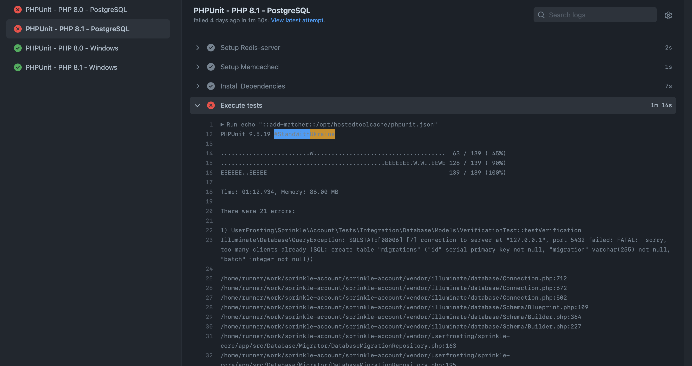
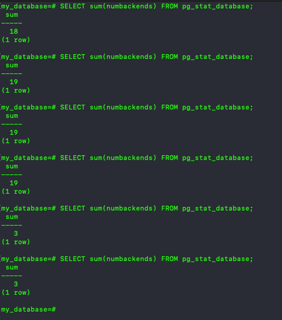
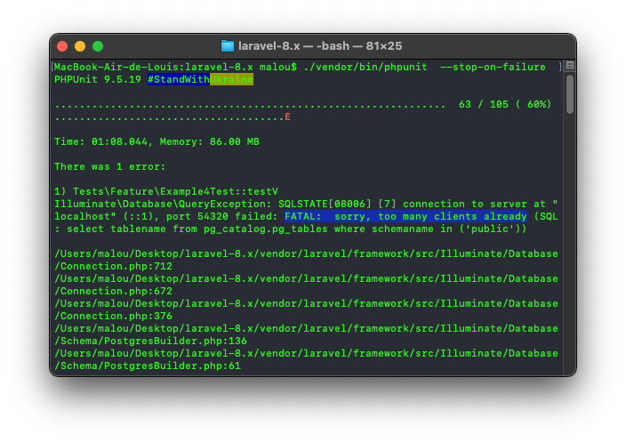
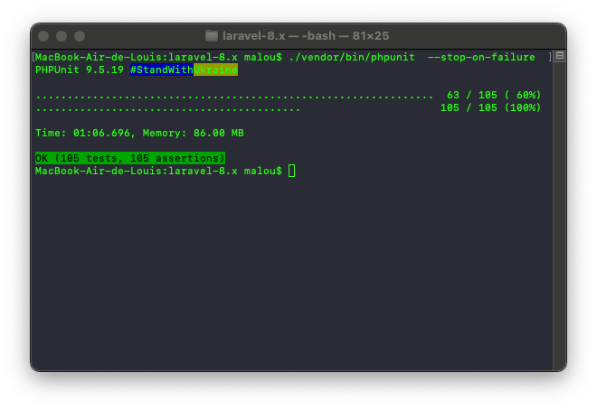

While I don't post often on this blog, I find it important to document specific problem, how I debugged it and the final fix. This is for future reference (for me), but also in case it might be helpful to someone someday. This is a tale about a PostgreSQL error, it's placebo fix and how going further to understand why it was happening uncovered a bug in Laravel.

===

## The Issue

This story starts with this [error on the PostgreSQL CI workflow](https://github.com/userfrosting/sprinkle-account/runs/5579203684?check_suite_focus=true) for the currently _work-in-progress_ UserFrosting 5 :

> `Illuminate\Database\QueryException: SQLSTATE[08006] [7] connection to server at "127.0.0.1", port 5432 failed: FATAL:  sorry, too many clients already`

[center][/center]

This error was only happening on the PostgreSQL workflow. It wasn't encountered on the MySQL or SQLite workflow. A quick search pointed out this error occurred because PostgreSQL has a maximum of [100 simultaneous active connections at a time, by default](https://www.postgresql.org/docs/14/runtime-config-connection.html). This error started appearing on our CI on a random commit, but it was quickly determined the commit itself wasn't the issue. After making sure dependency update or database update was not the actual issue, I was able to reproduce this error locally using a PostgreSQL Docker image. Turns out that commit was adding the 101+ test. 

Following [this Laravel issue][1], I was easy to confirm the test didn't close the connection. Using the following command on the docker image CLI while the tests were running showed the number of active connections going up, until PHPUnit run was over : 

```bash
SELECT sum(numbackends) FROM pg_stat_database;
```

[center][/center]

[notice]When testing this, keep in mind when it does works, there's still a small delay between the moment PHP closes the connection and the connection to the database is effectively closed. Depending on how fast your tests are executed, the number of active connection returned by `SELECT sum(numbackends) FROM pg_stat_database;` can go up to 20 before going back down. If the number goes up to 50 and keep going up, you can assumed PHP is not closing the connection properly and will fail when reaching 100.[/notice]

The [original Laravel issue][1] got fixed in way back in 2017 with [a simple PR][2] (that didn't actually got merged, the actual fix was [done in this PR][5]). Sure enough, UserFrosting 5 have his own TestCase since it only borrows part of Laravel. No ["post test" cleanup was done](https://github.com/userfrosting/framework/blob/77db8c3a27b405492cc4c55e5473ae4eb5fbd20c/src/Testing/TestCase.php#L26) either. So the fix was probably to add the `disconnect` call on the database manager in UF's tearDown method, same thign that was proposed in [Laravel's Pull Request #18752](https://github.com/laravel/framework/pull/18752/files) :

```php
protected function tearDown(): void
{
    parent::tearDown();
    
    /** @var \Illuminate\Database\Connection */
    $db = $this->ci->get(\Illuminate\Database\Connection::class);
    $db->disconnect();
}
```

But that **didn't** fix the issue. Hum...

The next steps involved trying to replicate on a fresh Laravel install, but I couldn't replicate on Laravel. So why is the `$db->disconnect();` works on Laravel, but not UF? At that point, the issue was happening on the `sprinkle-account` UF's repo, which depends on UF `framework` and `sprinkle-core` repo. I moved to the `sprinkle-core` repo and ran the existing test. The database CLI quickly pointed out the issue was **not** happening with the `core` sprinkle. The issue was with UF, not **not** the TestCase or UF's database setup? 

## The Plot Thickens...

Since UserFrosting 5 (again, work-in-progress) system [is fully modular](https://github.com/userfrosting/sprinkle-account/blob/8f27530545f7d07b0b80df7631b132595176ecc5/app/src/Account.php#L137), I started isolating each _Account_ migrations, services and whatnot, and found out [this migration](https://github.com/userfrosting/sprinkle-account/blob/8f27530545f7d07b0b80df7631b132595176ecc5/app/src/Database/Migrations/v430/UpdateGroupsTable.php#L39-L41) was causing the PostgreSQL connection not to be closed, event **after** calling `$db->disconnect();`  :

```php 
$this->schema->table('groups', function (Blueprint $table) {
    $table->string('icon', 100)->nullable()->change();
});
```

The culprit was the `->change()`, which is used to [update an existing table column attribute](https://laravel.com/docs/9.x/migrations#updating-column-attributes). To be clear, **without** `$db->disconnect();` in UserFrosting's `tearDown`, the connections where not closed no matter which migrations where executed. **With** `$db->disconnect();`, the connections were closed, but **only** if `->change()` wasn't used. Once I introduced `->change()` in a migration, disconnection stopped working.

UF's migration system uses Laravel's system. But the exact same "`->change()`" migration on a Laravel fresh install **wasn't** producing the error...

## The (Placebo) Fix

At this point, the migration is causing an issue with Userfrosting, but not with Laravel. `$db->disconnect();` "does it's job" with Laravel test bed, but not with UserFrosting. So what's the difference? 

Turns out, when Laravel finishes a test and the PHPUnit `tearDown` method is called, Laravel [flush and undefined the current app object](https://github.com/laravel/framework/blob/b9203fca96960ef9cd8860cb4ec99d1279353a8d/src/Illuminate/Foundation/Testing/TestCase.php#L163). Something UserFrosting doesn't do (yet). 

Back to UserFrosting 5 [TestCase](https://github.com/userfrosting/framework/blob/77db8c3a27b405492cc4c55e5473ae4eb5fbd20c/src/Testing/TestCase.php#L26), this `tearDown` was added : 

```php 
protected function tearDown(): void
{
    parent::tearDown();

    // Unset app
    unset($this->userfrosting);
    unset($this->app);
    unset($this->ci);
}
```

**And the _too many clients_ error is now gone.**

But why does **this** works, especially since, if you haven't notice, we don't disconnect the database? [PHP's PDO documentation](https://www.php.net/manual/en/pdo.connections.php) has the answer : 

> The connection remains active for the lifetime of that PDO object. **To close the connection, you need to destroy the object** by ensuring that all remaining references to it are deleted—you do this by assigning null to the variable that holds the object. If you don't do this explicitly, PHP will automatically close the connection when your script ends.

By assigning `null` to `$this->ci` (the PHP-DI Container), the connection object contained in the Container is destroyed, as will all other services.

[One commit later](https://github.com/userfrosting/framework/commit/28c020d8b950b4c185a9afc6b43de71e0987c451), the original error is now gone. And they lived happily ever after... or did they ? 

### The Actual Issue

_This is the important part_ : While deleting the App & CI object was actually fixing the issue, was it the real fix? Something felt wrong. Why wasn't `$db->disconnect();` enough to fix the issue? Curiosity got the hang of me, I needed to dig deeper. The fix felt like a placebo to a bigger issue.

After all, `$db->disconnect();` should do [it's job](https://github.com/laravel/framework/blob/888947cedacbefac4019a163ccf941e592edad82/src/Illuminate/Database/Connection.php#L827), which is to set the [Connection PDO object to null](https://github.com/laravel/framework/blob/888947cedacbefac4019a163ccf941e592edad82/src/Illuminate/Database/Connection.php#L1121). The connection is kept alive somehow, but where? Was it in the dependencies container, or elsewhere?

The first clue was found in [Laravel's documentation](https://laravel.com/docs/9.x/migrations#prerequisites): 

> Before modifying a column, you must install the `doctrine/dbal` package using the Composer package manager. The Doctrine DBAL library is used to determine the current state of the column and to create the SQL queries needed to make the requested changes to your column.

It makes sense to begin investigating with `doctrine/dbal`, since it required only when modifying a column. It's the only variable between adding a column (works) and modifying one (doesn't work) in a migration.

With the help of my dear friends XDebug and VSCode "Run and Debug", the breadcrumbs finally lead me to this piece of code inside [Laravel's `\Illuminate\Database\Connection`](https://github.com/laravel/framework/blob/b9203fca96960ef9cd8860cb4ec99d1279353a8d/src/Illuminate/Database/Connection.php#L1003-L1023):

```php 
public function getDoctrineConnection()
{
    if (is_null($this->doctrineConnection)) {
        $driver = $this->getDoctrineDriver();


        $this->doctrineConnection = new DoctrineConnection(array_filter([
            'pdo' => $this->getPdo(),
            'dbname' => $this->getDatabaseName(),
            'driver' => $driver->getName(),
            'serverVersion' => $this->getConfig('server_version'),
        ]), $driver);


        foreach ($this->doctrineTypeMappings as $name => $type) {
            $this->doctrineConnection
                ->getDatabasePlatform()
                ->registerDoctrineTypeMapping($type, $name);
        }
    }


    return $this->doctrineConnection;
}
```

Basically, when modifying a column, Laravel will create a new `DoctrineConnection`, which will receive `\Illuminate\Database\Connection`'s PDO object, and store it in `$this->doctrineConnection`. When Laravel `disconnect()` is called, the `\Illuminate\Database\Connection::$pdo` object (`$this->pdo`) will be undefined **but not `\Illuminate\Database\Connection::$doctrineConnection` (`$this->doctrineConnection`)**. The PDO instance will then live on inside `$this->doctrineConnection` (inside `\Illuminate\Database\Connection`), preventing the connection to be closed. That is, until the whole app is nuked, `\Illuminate\Database\Connection` with it. 

The following test was able to replicate the `FATAL:  sorry, too many clients already` error in a fresh Laravel app : 

_Migration:_
```php 
public function up()
{
    Schema::create('users', function (Blueprint $table) {
        $table->increments('id');
        $table->string('user_name', 50);
    });

    Schema::table('users', function (Blueprint $table) {
        $table->string('user_name', 120)->change();
    });
}
```

_Test:_
```php 
class ExampleTest extends TestCase
{
    use DatabaseMigrations; 

    protected function tearDown(): void
    {
        // parent::tearDown(); <-- Omitted on purposed (or not)

        DB::disconnect();
    }

    public function test_1()
    {
        $this->assertTrue(true);
    }

    public function test_2()
    {
        $this->assertTrue(true);
    }

    // Repeat test 102x times...

    public function test_105()
    {
        $this->assertTrue(true);
    }
}
```

Each 105 tests does this: Open a DB connection, run the migration (via `DatabaseMigrations` trait), assert true, then "close" the DB connection **without** destroying the app. Sure enough, after the 100th iteration, the errors will be triggered : 

[center][/center]

The [final (proposed) fix][6] for this issue is as simple as purging the `$this->doctrineConnection` inside [\Illuminate\Database\Connection::disconnect()](https://github.com/laravel/framework/blob/b9203fca96960ef9cd8860cb4ec99d1279353a8d/src/Illuminate/Database/Connection.php#L825-L828):

```php
public function disconnect()
{
    $this->setPdo(null)->setReadPdo(null);
    $this->doctrineConnection = null;
}
```

With this in place, the 105 tests are executed properly.

[center][/center]

### Conclusion

This whole story does show that an problem can something leads to a more profound issue. An even simpler answer might have been to simply set PostgreSQL default connection so more than 100. But was it ever a valid solution? Do you set 400, or 4000 or 9292 as the max number of connections? Un-setting the app in UserFrosting's TestCase might solve the CI error, but was it the real fix? Actually, both UF's TestCase fix and Laravel fix are required here.

Point is, it's worth it sometimes to dig a little deeper when you encounter an issue, to be sure you fix the real underlying issue. This time it was an unclosed database connection, but the next time you might find a more profound issue, like a memory leak or a security issue. Maybe the [Laravel bugfix request][6] will prove useful and avoid another issue in the future.

## References & Thanks
- [Postgre "too many clients already" on running tests][1]
- [Close all connections after test has finished][2]
- [PDO Too many connections when running test suite][3]
- [mariomka/laravel-pgsql-too-many-clients-test][4]
- [[5.4] Fix 'Too Many Connections' error during testing using `$connectionsToTransact`][5]


## Bonus : PostgreSQL using Docker

Want to run PostgreSQL locally using Docker for development purposes? Here's the quick tip how : 

[notice=tip]
**Step 1** : Run the container

`docker run -d --name my_postgres -v my_dbdata:/var/lib/postgresql/data -p 54320:5432 -e POSTGRES_PASSWORD=my_password postgres:13`

**Step 2** : Create a database

`docker exec -it my_postgres psql -U postgres -c "create database my_database"`

The credentials will be :

- **host** : localhost
- **port** : 54320
- **database** : 'my_database'
- **user** : 'postgres'
- **password** : 'my_password'

**Step 3**: To connect to the database from the inside the image CLI :

```
psql my_database postgres
```

**Bonus step**: Show number of active connections:

```
SELECT sum(numbackends) FROM pg_stat_database;
```

**Step 4**: Drop the database

```
psql -U postgres -c "drop database my_database"
```

Reference: [How to run PostgreSQL in Docker on Mac (for local development)](https://www.saltycrane.com/blog/2019/01/how-run-postgresql-docker-mac-local-development/)
[/notice]


[1]: https://github.com/laravel/framework/issues/18056
[2]: https://github.com/laravel/framework/pull/18752
[3]: https://github.com/laravel/framework/issues/18471
[4]: https://github.com/mariomka/laravel-pgsql-too-many-clients-test
[5]: https://github.com/laravel/framework/pull/20340
[6]: https://github.com/laravel/framework/pull/41584
